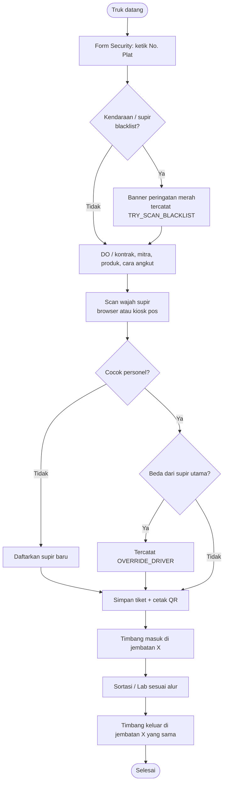
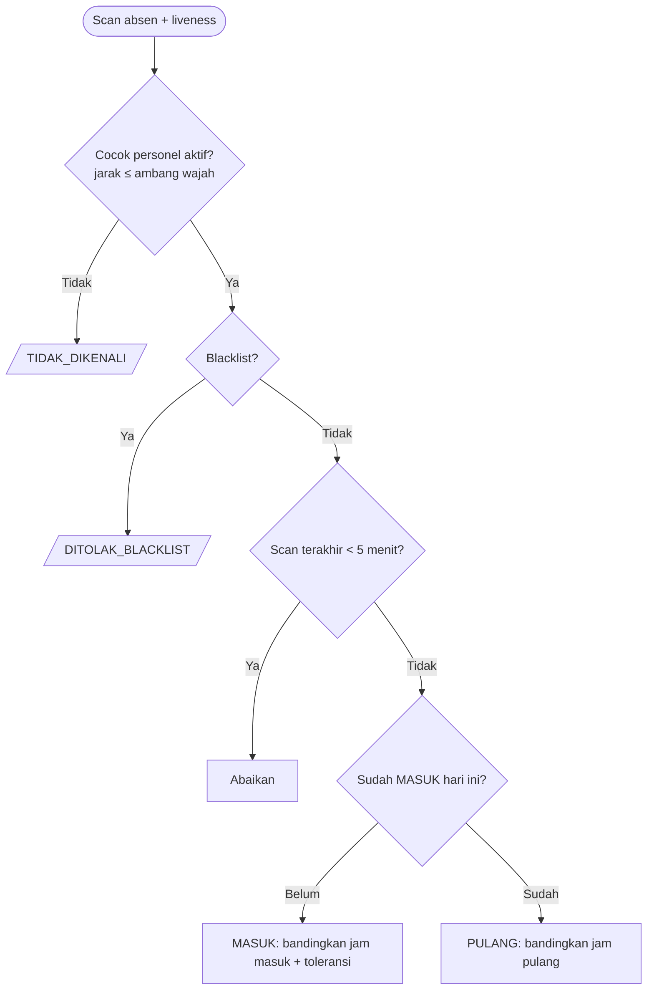
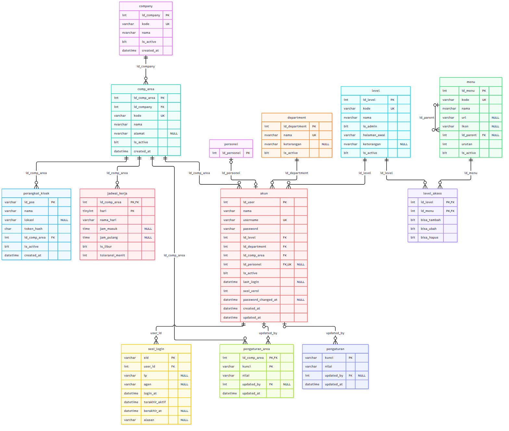
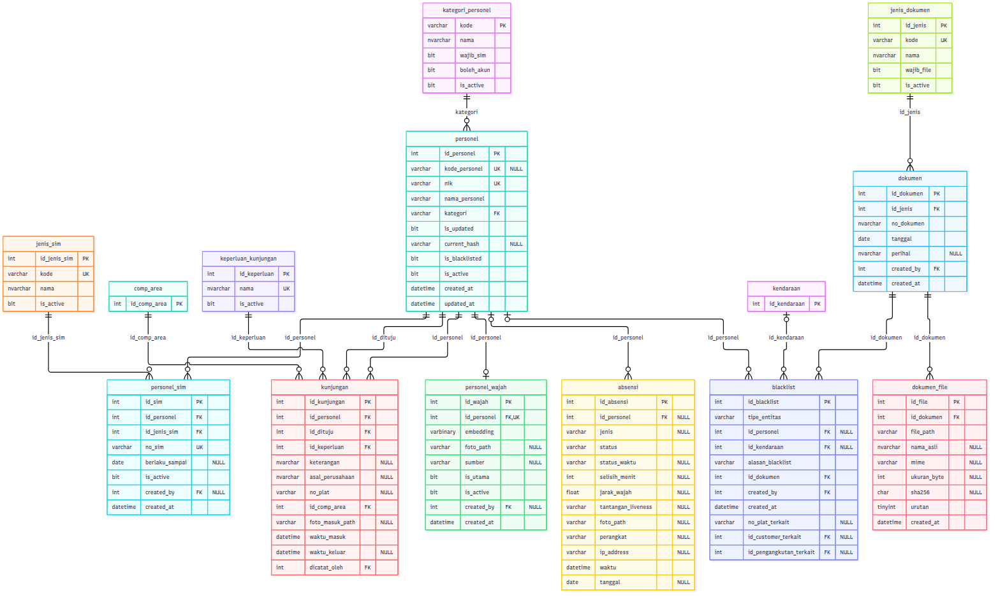
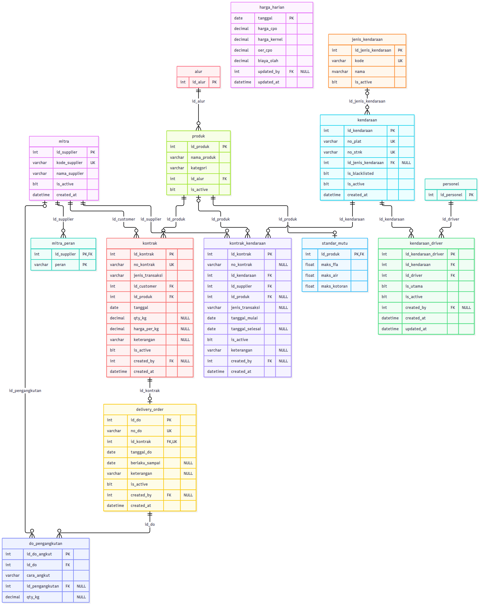
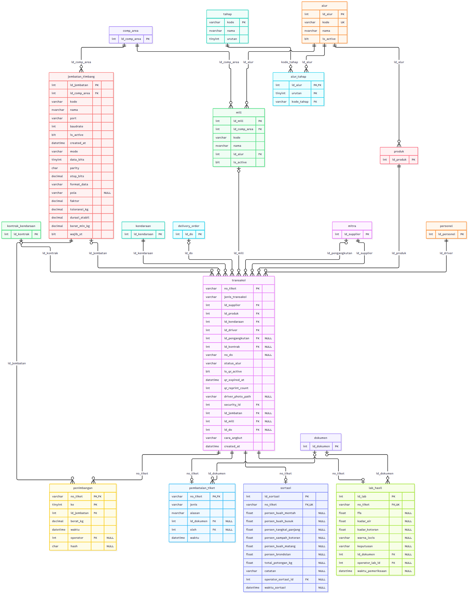
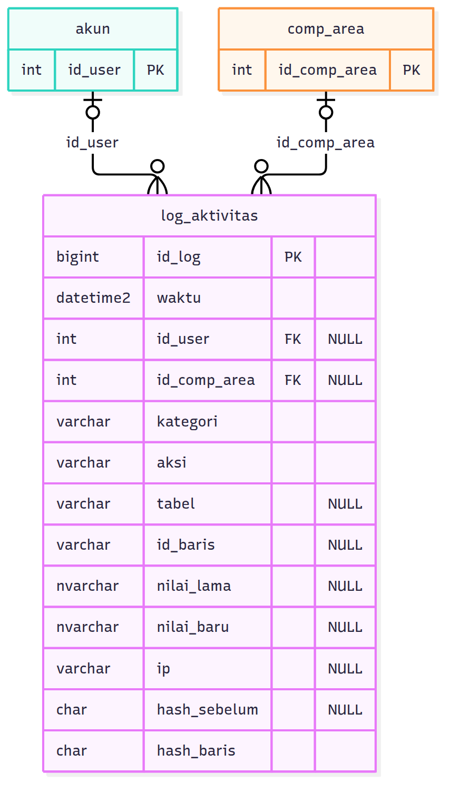

# Dokumentasi Sistem Timbangan Sawit (Smart Weighbridge)

Satu dokumen untuk perancangan, database, hak akses, admin, timbangan, keamanan, optimasi, dan pemasangan.
Desain Figma ada di [HANDOFF_FIGMA.md](HANDOFF_FIGMA.md); riwayat rencana ERD v3 di [ERD_V3.md](ERD_V3.md).

Daftar isi

1. [Gambaran umum](#1-gambaran-umum)
2. [Perancangan alur](#2-perancangan-alur)
3. [Database & ERD](#3-database--erd)
4. [Hak akses](#4-hak-akses)
5. [Halaman Admin](#5-halaman-admin)
6. [Timbangan (jembatan timbang)](#6-timbangan-jembatan-timbang)
7. [Kiosk kamera & pos](#7-kiosk-kamera--pos)
8. [Keamanan](#8-keamanan)
9. [Optimasi](#9-optimasi)
10. [Pemasangan, pindah laptop & update](#10-pemasangan-pindah-laptop--update)
11. [Aturan menulis kode](#11-aturan-menulis-kode)
12. [Masalah umum](#12-masalah-umum)

---

## 1. Gambaran umum

| Bagian | Isi |
|---|---|
| Aplikasi | Flask + flask-login, Jinja, Tailwind (build lokal), dijalankan dengan waitress (`serve.py`) |
| Database | SQL Server (Express cukup) lewat ODBC Driver 18 (`pyodbc`). Login Windows bila `DB_USER` kosong |
| Wajah | dlib (`dlib-bin`, tanpa kompilasi) + face_recognition, liveness di browser / kiosk |
| Timbangan | Indikator RS-232 dibaca server (LOKAL) atau agen di PC jembatan (AGEN), lihat bagian 6 |
| Python | 3.10 / 3.11 64-bit (mediapipe 0.10.9 belum ada untuk 3.12) |

### Menu

| Menu | Isi |
|---|---|
| Dashboard | Ringkasan tiket & harga harian (HO) |
| List | Tiket aktif per tahap: Security → Timbangan → Sortasi / Lab → Timbangan, + history |
| Form | Create Ticket (Security), Timbangan, Sortasi, Laboratorium |
| Face Recognition | Absensi, Personel, Blacklist, Kunjungan Tamu, Audit Log |
| Kontrak & DO | Kontrak (1 kontrak = 1 produk = 1 DO) dan pengangkutan DO |
| Data Master | Driver, Kendaraan, Mitra (customer / pengangkutan), Produk |
| Admin | Hanya level admin, lihat bagian 5 |

### Struktur folder

```
app.py / serve.py         aplikasi (serve.py = dipakai di site, waitress)
routes/                   satu blueprint per menu (security, timbangan, master, admin, agen, ...)
utils/                    akses database (db_*), hak akses, keamanan, serial_reader (timbangan), log_aktivitas
templates/                base.html + partials/<menu>/ (tab, modal)
static/js/                common, api (Api/Poller), ui (Notif/Dialog), aksi (data-on-click), pilih_cari (dropdown ketik)
static/css/               tailwind-source.css → tailwind.css (npm run build-css)
database/schema.sql       database baru dari nol (setara migrasi 001–019)
database/migrations/      perubahan bertahap untuk database yang sudah ada
database/pindah/          backup, restore, cek versi database
agen/                     agen timbangan untuk PC jembatan (+ exe tanpa Python)
kiosk_timbang.py          kiosk kamera scan wajah di pos
tools/                    pasang_windows.bat, jalankan.bat, cek_lingkungan.py, gen_erd.py, uji_beban.py
tests/                    unit test (python -m pytest)
```

---

## 2. Perancangan alur

### 2.1 Alur tiket

Urutan tahap tidak ditulis di kode: produk menunjuk **alur** (`alur` → `alur_tahap`), dan tiket memakai **mill** aktif di
area Security sesuai alur produk.

| Alur | Tahap |
|---|---|
| TBS | Security → Timbang masuk → Sortasi → Timbang keluar |
| PKS (produk PKS) | Security → Timbang masuk → Lab → Timbang keluar |
| Penimbangan saja | Security → Timbang (sekali) |



- Blacklist adalah **peringatan**: tiket tetap bisa dibuat, tetapi setiap deteksi dan tiket tercatat di Audit Log untuk HO.
  Status blacklist permanen (trigger database).
- Tiket tanpa scan wajah (bila `WAJIB_SCAN_WAJAH` mati) tercatat `MANUAL_INPUT`.
- Timbang keluar **wajib di jembatan yang sama** dengan timbang masuk (trigger `TR_Penimbangan_JembatanSama`).
- Tiket salah input dibatalkan Admin (Void), bukan dihapus; lab bisa REJECT.

### 2.2 Personel

| | `id_personel` | `kode_personel` |
|---|---|---|
| Dibuat | Otomatis (IDENTITY) | Oleh HO, saran otomatis `PRGBS-###` |
| Berubah | Tidak pernah | Boleh, tercatat di log |
| Dipakai | Semua relasi | Tampilan & pencarian |

Kategori: DRIVER (wajib SIM), SECURITY, EMPLOYEE, TAMU. Wajah boleh lebih dari satu per orang (`personel_wajah`).
Pendaftaran foto menolak foto dengan 0 / lebih dari 1 wajah, wajah yang mirip personel lain, dan wajah blacklist.
Hapus personel = nonaktif (riwayat tetap). Akun login dan personel terpisah (`akun.id_personel` opsional);
tamu tidak boleh punya akun.

### 2.3 Absensi



Jadwal kerja **per area** (Admin › Jadwal Kerja); area diambil dari pos kiosk / akun yang men-scan. Hari libur tetap
dicatat `HARI_LIBUR`. Hari dihitung dengan `isoweekday()` (tidak bergantung `SET DATEFIRST`). Rekap memakai MASUK pertama
dan PULANG terakhir per hari.

### 2.4 Blacklist & dokumen

HO memilih personel / kendaraan, mengisi no. surat, tanggal, alasan, dan mengunggah surat (`dokumen` + `dokumen_file`,
sha256). Blacklist permanen. Berita acara void dan COA lab juga disimpan sebagai `dokumen`.

### 2.5 Kunjungan tamu

Tamu = personel kategori TAMU dengan foto wajah. Setiap datang: scan wajah → baris `kunjungan` (siapa yang dituju,
keperluan) → catat keluar.

### 2.6 Kontrak, DO & pengangkutan

1 kontrak = 1 produk = 1 DO. Satu DO boleh beberapa pengangkut: kendaraan PENGIRIM, kendaraan PENERIMA, atau PIHAK_KETIGA
(mitra berperan pengangkutan), masing-masing dengan alokasi qty. Siapa pengirim / penerima mengikuti jenis transaksi
(PEMBELIAN: pengirim = mitra; PENJUALAN: pengirim = PT sendiri).

---

## 3. Database & ERD

Sumber kebenaran: **`database/schema.sql`** (database baru dari nol, setara migrasi 001–019). Gambar dibuat otomatis dari
katalog SQL Server dengan `tools/gen_erd.py`: 47 tabel, 82 foreign key.

Diagram lengkap: [lengkap.svg](erd/lengkap.svg) (zoom di browser) · [lengkap.pdf](erd/lengkap.pdf) · [lengkap.png](erd/lengkap.png)

Cara membaca: `PK` primary key, `FK` foreign key, `UK` unik, `"NULL"` boleh kosong. Kolom pencatat (`created_by`, `oleh`,
`operator_*`) menunjuk `akun` dan hanya digambar di diagram lengkap.

### 3.1 Organisasi, akun & hak akses



| Tabel | Isi |
|---|---|
| `company` → `comp_area` | Perusahaan (PT) dan area / site miliknya. Kode = singkatan unik, nama = nama lengkap |
| `department` | Bagian (Umum, Security, Timbangan, QC / Lab, Head Office) |
| `level` → `level_akses` ← `menu` | Pengganti role: per level, per menu boleh tambah / ubah / hapus |
| `akun` | Login: level, department, area, `sesi_versi`, `password_changed_at` |
| `sesi_login` | Sesi dari semua PC (Sesi Aktif, 1 user 1 perangkat) |
| `pengaturan` / `pengaturan_area` | Pengaturan global; operasional bisa ditimpa per area |
| `perangkat_kiosk` | Pos (PC yang boleh mengirim data tanpa login: kiosk kamera & agen timbangan), token hash |
| `jadwal_kerja` | Jadwal per area (PK area + hari) |

### 3.2 Personel, wajah, kunjungan, absensi, blacklist & dokumen



| Tabel | Isi |
|---|---|
| `kategori_personel` → `personel` | View `v_personel` memberi bentuk lama (no_sim, foto, embedding) |
| `jenis_sim` → `personel_sim` | SIM dengan masa berlaku; No SIM aktif unik |
| `personel_wajah` | Embedding & foto wajah |
| `keperluan_kunjungan` → `kunjungan` | Kunjungan tamu |
| `absensi` | Scan wajah + liveness, status waktu |
| `blacklist` | Personel / kendaraan, wajib surat; permanen |
| `jenis_dokumen` → `dokumen` → `dokumen_file` | Surat blacklist, berita acara void, COA lab |

### 3.3 Mitra, kendaraan, produk, kontrak & DO



| Tabel | Isi |
|---|---|
| `mitra` + `mitra_peran` | Customer dan / atau pengangkutan (nama kolom tetap `id_supplier`) |
| `jenis_kendaraan` → `kendaraan` | No plat unik, No STNK wajib & unik |
| `kendaraan_driver`, `kontrak_kendaraan` | Supir per truk (supir utama), kontrak truk ↔ mitra |
| `produk` → `standar_mutu` | Produk menentukan alur tahap; standar mutu lab |
| `kontrak` → `delivery_order` → `do_pengangkutan` | Lihat 2.6 |
| `harga_harian` | Harga CPO / kernel untuk dashboard |

### 3.4 Proses tiket



| Tabel | Isi |
|---|---|
| `tahap`, `alur` → `alur_tahap`, `mill` | Urutan tahap per alur, mill per area |
| `jembatan_timbang` | Beberapa jembatan per area + profil indikator (bagian 6) |
| `transaksi` | Tiket: mitra, produk, kendaraan, supir, mill, DO, cara angkut, jembatan masuk |
| `penimbangan` | 2 baris per tiket (masuk, keluar). View `v_timbangan` memberi bruto / tara / netto |
| `sortasi`, `lab_hasil` | Inspeksi; COA lab = dokumen |
| `pembatalan_tiket` | VOID (Admin, berita acara boleh menyusul) / REJECT (lab) |

### 3.5 Log aktivitas



`log_aktivitas` (kategori ADMIN, SECURITY, PERSONEL, STANDAR_MUTU, TIMELINE, MASTER, ...), isi lama & baru JSON.
Setiap baris menyimpan hash baris sebelumnya (SHA-256), ditulis hanya lewat `sp_catat_log`, dan trigger menolak UPDATE /
DELETE. View `v_log_rusak` (Admin › Audit Admin › Verifikasi rantai log) menunjukkan baris yang diubah langsung di database.

### 3.6 Aturan di database

| Objek | Aturan |
|---|---|
| `TR_Penimbangan_JembatanSama` | Timbang keluar di jembatan yang sama, setelah timbang masuk |
| `TR_Personel_BlacklistPermanen`, `TR_Kendaraan_BlacklistPermanen` | Blacklist tidak bisa dicabut |
| `TR_Log_HanyaTambah` | Log tidak bisa diubah / dihapus |
| `CK_DoAngkut_PihakKetiga`, `CK_Trx_CaraAngkut` | `id_pengangkutan` hanya untuk PIHAK_KETIGA |
| `UX_DO_Kontrak`, `UX_Kendaraan_Stnk`, `UX_PersonelSim_NoAktif` | 1 kontrak 1 DO; STNK unik; SIM aktif unik |
| `CK_Jembatan_Profil` | Nilai profil indikator yang sah (mode, bits, parity, format, ...) |
| `READ_COMMITTED_SNAPSHOT` (migrasi 018) | Baca data tidak menunggu kunci tulis (mencegah timeout 15 detik) |

### 3.7 Migrasi

| No | Isi |
|---|---|
| 001–007 | Kendaraan / driver / kontrak, personel & blacklist, index, admin, DO & void, password & dashboard, sesi login. **Jangan dijalankan ulang** di database yang sudah dimigrasi |
| 008–010 | Organisasi & hak akses, personel (SIM, wajah, kunjungan), dokumen & pembatalan |
| 011–014 | Jembatan & penimbangan, alur & mill, kontrak → DO → pengangkutan, kendaraan / jadwal / pengaturan / COA |
| 015–016 | Log aktivitas tunggal; rename `users`→`akun`, `supplier`→`mitra` (hentikan `serve.py` saat 016) |
| 017 | Profil indikator per jembatan (mode LOKAL / AGEN, bits, parity, format, faktor, stabil, berat minimum) |
| 018 | `READ_COMMITTED_SNAPSHOT` (ganti nama database di file bila berbeda) |
| 019 | Menu Data Master › Mitra & Produk (pindah dari Admin) |

008–019 aman dijalankan ulang. Migrasi menulis `USE [DbSistemTimbangan_Test]`: ganti bila nama database berbeda.
Cek database kurang apa: `database/pindah/cek_versi_database.sql`.

Membuat ulang gambar ERD:
```
python tools/gen_erd.py
npx -p @mermaid-js/mermaid-cli mmdc -i docs/erd/04_proses_tiket.mmd -o docs/erd/04_proses_tiket.png -s 2
```

---

## 4. Hak akses

Diatur di **Admin › Level & Hak Akses**, disimpan di `level`, `menu`, `level_akses`.

- Semua level non-admin **melihat semua menu**; yang dibatasi aksi (tombol & API).
- Level `is_admin` hanya membuka area Admin, tanpa aksi operasional (tidak bisa membuat tiket, menimbang, atau mengelola Data Master).
- Kode: `@izin('KODE_MENU', 'aksi')` di API, `boleh('KODE_MENU', 'aksi')` di template (`utils/hak_akses.py`).
  Perubahan berlaku ±30 detik di semua PC tanpa login ulang. Mengganti level user mengakhiri sesinya.

### Isi awal

| Menu (kode) | HO | SECURITY | OPERATOR_TIMBANG | SORTASI | LAB |
|---|---|---|---|---|---|
| Dashboard (`DASHBOARD`): harga harian | ubah | – | – | – | – |
| Form › Security (`FORM_SECURITY`) | – | tambah, ubah | – | – | – |
| Form › Timbangan (`FORM_TIMBANGAN`) | – | – | tambah | – | – |
| Form › Sortasi (`FORM_SORTASI`) | – | – | – | tambah | – |
| Form › Laboratorium (`FORM_LAB`): hasil (tambah), standar mutu (ubah) | – | – | – | – | tambah, ubah |
| Face Recognition › Personel (`PERSONEL`) | tambah, ubah, hapus | – | – | – | – |
| Face Recognition › Blacklist (`BLACKLIST`) | tambah | – | – | – | – |
| Face Recognition › Kunjungan Tamu (`KUNJUNGAN`) | – | tambah, ubah | – | – | – |
| Kontrak & DO (`KONTRAK_DO`) | tambah, ubah, hapus | – | – | – | – |
| Data Master › Driver (`MASTER_DRIVER`) | tambah, ubah, hapus | tambah, ubah, hapus | – | – | – |
| Data Master › Kendaraan (`MASTER_KENDARAAN`) | tambah, ubah | tambah, ubah | – | – | – |
| Data Master › Mitra (`MASTER_MITRA`), Produk (`MASTER_PRODUK`) | tambah, ubah | – | – | – | – |
| List, Absensi, Audit Log | lihat | lihat | lihat | lihat | lihat |

Cukup login (semua level non-admin): melihat list & history, cari plat / NIK, scan QR, cetak tiket, berat live,
scan absensi, rekap, daftar personel & blacklist, Audit Log + ekspor, membuka foto / surat (`/berkas`).

---

## 5. Halaman Admin

Hanya level admin (bawaan `ADMIN`); level lain yang membuka `/admin` mendapat 403. Login awal database baru:
`admin` / `admin12345` (wajib ganti password).

| Menu | Isi | Berlaku |
|---|---|---|
| Kelola User | Tambah, ubah nama / level / department / area, reset password, aktif / nonaktif (tidak dihapus) | Ganti level / reset / nonaktif → sesi user itu berakhir |
| Level & Hak Akses | Level, halaman awal, matriks Tambah / Ubah / Hapus per menu | ±30 detik |
| Organisasi | Company, area, department, mill | Langsung |
| Sesi Aktif | Siapa login dari PC mana, paksa keluar, buka kunci login | Langsung |
| Void Tiket | Batalkan tiket salah input (wajib alasan), berita acara saat itu atau menyusul | Langsung |
| Jadwal Kerja | Per area: libur, jam masuk / pulang, toleransi | Scan berikutnya |
| Pengaturan Site | Global; per area untuk wajib scan wajah & ambang wajah. Keamanan selalu global | ±30 detik |
| Perangkat / Kiosk | Pos + token, jembatan timbang + profil indikator, berat live & data mentah | Langsung |
| Log Keamanan | `logs/keamanan.log` (rotasi 5 × 5 MB, maks ±30 MB) | – |
| Audit Admin | Perubahan oleh admin + Verifikasi rantai log | – |
| Kesehatan Sistem | Database, backup terakhir, disk, upload, timbangan, versi, uptime | – |

### Waktu & batas

Urutan nilai: area (pengaturan operasional) → Admin › Pengaturan Site → `.env` → bawaan (`utils/pengaturan.py`).

| Yang diatur | Pengaturan | Bawaan |
|---|---|---|
| Salah password sebelum dikunci / rentang / lama kunci | `LOGIN_MAKS_GAGAL` / `LOGIN_JENDELA_MENIT` / `LOGIN_KUNCI_MENIT` | 5 / 15 menit / 15 menit |
| Logout otomatis bila tidak aktif (peringatan 2 menit sebelumnya) | `SESI_IDLE_MENIT` | 120 menit |
| Umur sesi maksimal | `SESI_MAKS_JAM` | 12 jam |
| Password kedaluwarsa (0 = tidak pernah) | `PASSWORD_EXPIRED_HARI` | 90 hari |
| 1 user 1 perangkat | `SATU_PERANGKAT` | true |
| Wajib scan wajah supir | `WAJIB_SCAN_WAJAH` | true |
| Ambang kemiripan wajah | `AMBANG_WAJAH` | 0.55 |
| Hasil scan wajah berlaku | – (`utils/verifikasi_state.py`) | 5 menit |
| Timeout request browser | – (`static/js/api.js`) | 15 detik |
| Request lambat dicatat | `LOG_REQUEST_LAMBAT_MS` (.env) | 1000 ms |
| Query database dibatalkan setelah | `DB_QUERY_TIMEOUT` (.env) | 15 detik |

---

## 6. Timbangan (jembatan timbang)

### 6.1 Cara kerja

```
Indikator ──kabel RS-232──► PC jembatan
                            ├─ agen (jendela kecil) ──LAN──► server http://IP-SERVER:5000  (data mentah ±3x/detik)
                            └─ browser operator ─────LAN──► server http://IP-SERVER:5000  (tab Timbangan)
```

- Server membaca berat **terus-menerus** sejak menyala (walau belum ada tiket). Berat baru tersimpan saat operator
  memilih tiket lalu klik simpan.
- Satu pembaca per jembatan (`utils/serial_reader.py`), di memori: tidak menulis database sampai simpan.
- Kabel indikator tetap di PC jembatan (RS-232 hanya kuat ±15 m). Operator membuka IP server di browser seperti biasa.
- Beban: 4 jembatan ≈ 13 request kecil per detik dari agen + polling browser 2x per detik hanya saat tab Timbangan
  terbuka dan terlihat. Ringan.

### 6.2 Mode sambungan (per jembatan)

| Kabel indikator dicolok ke | Mode | Port | Yang dijalankan |
|---|---|---|---|
| **PC jembatan** (1 PC per jembatan, paling umum) | AGEN | COM di PC jembatan, mis. `COM3` | `agen\jalankan.bat` di PC jembatan |
| PC server | LOKAL | COM di PC server | Tidak ada |
| Alat serial-to-LAN (USR-TCP232, Moxa) | LOKAL | `socket://192.168.1.50:4001` | Tidak ada |

### 6.3 Profil indikator (Admin › Perangkat / Kiosk › Jembatan Timbang)

Tiap jembatan punya profil sendiri, jadi PT A dan PT B boleh berbeda merk.

| Isian | Arti | Cara mendapatkan |
|---|---|---|
| Area, Kode, Nama | Lokasi & nama jembatan (mis. JT-1) | Bebas, kode unik per area |
| Kabel indikator dicolok ke | Mode AGEN / LOKAL | Lihat langsung kabelnya |
| Port | Colokan COM | Device Manager › Ports (COM & LPT) di PC yang dicolok; cabut-pasang kabel untuk memastikan |
| Baudrate | Kecepatan kirim | Program timbangan lama (menu port), manual / menu setting indikator, atau `deteksi.bat` |
| Data bits / Parity / Stop bits | Bentuk tiap karakter | Sama dengan baudrate. Umum **9600 7E1** atau **9600 8N1** |
| Format | Bentuk teks dari indikator | Tombol **Data mentah** (tabel 6.5) |
| Pola | Regex sendiri, hanya untuk format POLA: grup `(?P<berat>...)`, opsional `(?P<stabil>...)` | Biasanya kosong |
| Faktor ke kg | Pengali | `1` bila kg, `1000` bila indikator mengirim ton |
| Toleransi (kg) / Lama stabil (detik) | Stabil = tidak berubah lebih dari toleransi selama lama stabil | Bawaan 5 kg / 3 detik |
| Berat minimum (kg) | Berat di bawah ini ditolak (timbangan kosong / truk belum naik penuh) | Bawaan 100; PT B: 2000 |
| Wajib tanda ST | Indikator juga harus mengirim tanda stabil | Centang hanya bila data mentah memuat `ST` / `US` |

Perubahan profil langsung berlaku: pembaca di server menyambung ulang, agen di PC jembatan mengambil pengaturan baru sendiri.

### 6.4 Langkah pemasangan (contoh PT A: 4 jembatan, 1 PC per jembatan, server di laptop)

**A. Server (laptop)**
1. Jalankan `tools\jalankan.bat` (atau `python serve.py`). Catat IP laptop (`ipconfig`, mis. `192.168.1.10`).
2. Buka port 5000 (Command Prompt sebagai Administrator, sekali saja):
   `netsh advfirewall firewall add rule name="Weighbridge 5000" dir=in action=allow protocol=TCP localport=5000`

**B. Admin › Perangkat / Kiosk**
1. **Tambah Pos** untuk tiap PC jembatan: ID `POS-JT1` … `POS-JT4`, area jembatannya. Token tampil **sekali**: salin. Hilang → **Ganti token**.
   Pos bukan hanya untuk kamera; pos = PC yang boleh mengirim data ke server. PC yang juga menjadi kiosk kamera boleh
   memakai pos yang sama.
2. **Tambah Jembatan Timbang** JT-1 … JT-4: kabel = PC jembatan, Port = COM di PC itu, profil indikator (6.3).
   Catat **ID agen** di tabel.

**C. Tiap PC jembatan**
1. Ada Python: salin folder `agen\`, klik `pasang.bat` sekali.
   Tidak ada Python: di laptop klik `agen\buat_exe.bat` sekali (butuh internet) → `agen_timbang.exe`. Lalu di PC jembatan
   buka Chrome ke `http://IP-SERVER:5000/agen/unduh` (login dulu; Admin: tombol **Unduh Agen** di Perangkat / Kiosk) →
   `agen.zip` berisi `agen_timbang.exe`, `jalankan.bat`, `deteksi.bat`, `.env`. Ekstrak ke mis. `D:\agen` (tanpa flashdisk).
2. Isi `.env` (dari zip; bila menyalin manual: ganti nama `.env.contoh` menjadi `.env`):
   ```
   WEIGHBRIDGE_URL=http://192.168.1.10:5000
   JEMBATAN_ID=1              ← ID agen JT-1
   KIOSK_ID=POS-JT1
   KIOSK_TOKEN=<token POS-JT1>
   ```
3. Klik `jalankan.bat`. Muncul `terhubung, mengirim ke ...` = berjalan. Biarkan jendela terbuka (minimize saja).
4. Browser ke `http://192.168.1.10:5000`, login operator timbang, tab Timbangan → pilih **JT-1** (sekali per PC,
   disimpan di cookie browser PC itu).

**D. Cek**: Admin › Perangkat / Kiosk › tombol **Data mentah** jembatan itu harus menampilkan angka yang sama dengan
layar indikator.

Pilihan token:
- Per pos (disarankan): tiap PC punya token sendiri, bisa dicabut satu per satu.
- Token bersama: isi `KIOSK_TOKEN=...` di `.env` **server** lalu restart; semua agen memakai token itu (`KIOSK_ID` bebas).
  Praktis untuk uji coba, kurang aman.
- Agen di PC server sendiri (localhost) tidak butuh token.

### 6.5 Menyetel indikator merk baru di lokasi

1. Tidak tahu baudrate / parity: tutup program timbangan lama (satu COM hanya bisa dipakai satu program), lalu di PC
   jembatan jalankan `deteksi.bat COM3`. Agen mencoba 9600 / 2400 / 4800 / 1200 / 19200 × 7E1 / 8N1 / 7O1 / 8E1 / 7N2 dan
   menampilkan 3 yang paling terbaca. Lihat data mentah tanpa server: `agen_timbang.exe --lihat COM3 9600 7E1`.
2. Isi profil di Admin, simpan, buka **Data mentah**:

   | Data mentah | Format / tindakan |
   |---|---|
   | `ST,GS,+00024150kg` | **ST_GS** |
   | `WN0024150kg`, `+024150`, `24150 kg` | **ANGKA** |
   | `=0.05142` (digit terbalik, XK3190 / A9) | **TERBALIK** |
   | Lain | **POLA** (regex sendiri) |
   | Huruf acak / kotak-kotak | Baudrate / parity / data bits salah |
   | Teks jelas tetapi kolom "Terbaca" kosong | Format salah |
   | Angka 1000× terlalu kecil / besar | Ubah Faktor |
3. Naikkan beban, bandingkan layar indikator dengan kolom "Terbaca".

### 6.6 Aturan simpan berat

Server menolak simpan bila:

| Pesan | Sebab |
|---|---|
| Pilih jembatan timbang untuk PC ini | Belum memilih jembatan di tab Timbangan |
| Timbangan JT-x tidak terhubung: ... | Agen mati / jaringan putus (> 5 detik tanpa data) / COM gagal dibuka |
| Berat belum stabil | Masih berubah > toleransi dalam lama stabil (atau tanda ST belum ada bila wajib) |
| Berat ... di bawah minimum ... kg | Kurang dari berat minimum jembatan |
| Timbang keluar harus di JT-x | Tiket masuk di jembatan lain |
| Belum bisa timbang kedua, tiket masih menunggu ... | Sortasi / lab belum selesai |

Status di tab Timbangan: **Stabil** / **Bergerak** / **Kosong** / **Tidak terhubung** (dengan alasan).

| Tampil | Artinya |
|---|---|
| Agen di PC jembatan tidak mengirim data | Jendela agen tertutup, PC mati, atau jaringan putus |
| Agen: port COM3 gagal dibuka | COM salah atau dipakai program lain |
| Jendela agen: `[server] Perangkat tidak dikenal` | `KIOSK_ID` / `KIOSK_TOKEN` salah |
| Jendela agen: `[server] Jembatan JT-x memakai mode Lokal ...` | Ubah "Kabel indikator dicolok ke" menjadi PC jembatan |
| Jendela agen: `[server] Jembatan id N tidak ada / nonaktif` | `JEMBATAN_ID` salah (lihat ID agen di tabel jembatan) |
| Jendela agen: `[server] tidak bisa dihubungi` | `WEIGHBRIDGE_URL` salah, server mati, atau firewall port 5000 |

### 6.7 API agen

| Metode | Endpoint | Keterangan |
|---|---|---|
| GET | `/api/agen/jembatan/<id>/konfigurasi` | Port & profil serial untuk agen |
| POST | `/api/agen/jembatan/<id>/data` | Teks mentah, status terhubung / error. Tanpa CSRF; wajib header `X-Kiosk-Id` + `X-Kiosk-Token` |

---

## 7. Kiosk kamera & pos

- Satu kiosk di PC server: tidak perlu apa-apa (pos `UTAMA`).
- Beberapa pos: buat pos di Admin › Perangkat / Kiosk; di `.env` **PC kiosk** isi `KIOSK_ID`, `KIOSK_TOKEN`,
  `WEIGHBRIDGE_URL=http://<IP-server>:5000`, lalu jalankan `kiosk_timbang.py`. Di tiap PC Security pilih sekali "Pos kamera"
  di Form Security › Informasi Driver (diingat browser itu).
- Hasil scan hanya bisa dipakai user yang menekan "Mulai Scan Wajah", berlaku 5 menit.
- Token disimpan sebagai hash SHA-256; token asli tampil sekali. `KIOSK_TOKEN` di `.env` server = token bersama untuk semua pos.

---

## 8. Keamanan

| Poin | Penerapan |
|---|---|
| Kunci rahasia | Aplikasi menolak start bila `SECRET_KEY` / `HASH_SECRET_KEY` kosong / contoh / < 32 karakter. Buat: `python -c "import secrets; print(secrets.token_hex(32))"`. `HASH_SECRET_KEY` jangan diganti setelah ada data (hash tiket lama dianggap rusak). **Jangan commit `.env`** |
| Sesi | Cookie `HttpOnly`, `SameSite=Lax`, `Secure` bila HTTPS; idle 120 menit, maks 12 jam; 1 user 1 perangkat; paksa keluar lewat `akun.sesi_versi` |
| Login | 5x gagal / 15 menit → kunci 15 menit (per username & IP); password pbkdf2, min 8 karakter, kedaluwarsa 90 hari |
| CSRF | Semua POST (Flask-WTF), `fetch` mengirim `X-CSRFToken`. Pengecualian: data agen (pakai token pos) |
| Header | CSP `script-src 'self'` (tanpa script inline), X-Frame-Options, nosniff, Referrer-Policy, Permissions-Policy, HSTS bila HTTPS |
| XSS | Data server ke `innerHTML` lewat `escapeHtml`; event lewat `data-on-click` (bagian 11) |
| Upload | Cek signature JPG / PNG / PDF, gambar dibuka ulang (buang metadata), disimpan privat di `data/uploads`, dibuka lewat `/berkas/...` (wajib login) |
| Endpoint perangkat | Kiosk & agen: login **atau** `X-Kiosk-Id` + `X-Kiosk-Token` benar; ditolak tercatat `KIOSK_DITOLAK` |
| Database | Akun SQL hak minimal `database/keamanan/01_user_aplikasi.sql` (jalankan ulang setelah migrasi 016); log hanya lewat `sp_catat_log`; backup harian `02_backup_harian.sql` |
| Log | `logs/keamanan.log` (login, gagal, terkunci, 403, CSRF, kiosk ditolak, sesi habis), rotasi 5 × 5 MB; aktivitas data di `log_aktivitas` berantai hash |
| HTTPS | `deploy/Caddyfile`, `.env`: `BEHIND_PROXY=1`, `COOKIE_SECURE=1`, `HOST=127.0.0.1`. Kamera browser dari PC lain butuh HTTPS |
| Mode debug | Mati di `serve.py`; `app.py` hanya untuk PC sendiri (127.0.0.1) |
| Firewall | Buka hanya port aplikasi (5000 / 443). Port SQL 1433 hanya untuk PC server aplikasi. Jaringan Windows = Private |
| Library | `pip install pip-audit && pip-audit -r requirements.txt` |

Batasan: CSP masih `style-src 'unsafe-inline'`; pembatas login & state scan wajah ada di memori proses (restart = nol).

Perilaku yang terlihat user: Back setelah logout tetap di login (`Cache-Control: no-store`); dialog "Tetap masuk / Keluar"
2 menit sebelum logout otomatis; polling (berat, status scan) tidak dihitung aktivitas.

---

## 9. Optimasi

| Bagian | Penerapan |
|---|---|
| Server | waitress 8 thread (`HOST`, `PORT`, `THREADS` di `.env`) |
| Wajah | Maks 2 proses dlib sekaligus (`MAKS_PROSES_WAJAH`), lainnya antre maks 30 detik lalu 503; embedding personel aktif di-cache di memori (numpy) dan dimuat ulang saat personel berubah; frame diperkecil di browser (480 px, 10 frame) |
| Polling | `Poller` baru meminta lagi setelah jawaban datang, berhenti saat tab tidak terlihat; scan wajah berhenti setelah 90 detik |
| Request | `Api` timeout 15 detik (wajah 60 detik), tombol "Memproses..." mencegah klik ganda, pesan error bahasa Indonesia |
| Database | Index (migrasi 003), kolom seperlunya (tanpa `SELECT *`), batas baris (personel / blacklist 200, audit 300), pooling ODBC, timeout query 15 detik, `READ_COMMITTED_SNAPSHOT` |
| Cache | Statis 1 tahun + `?v=`; halaman & API `no-store`; data master (mitra, produk, jadwal, standar mutu) 5 menit; hak akses & pengaturan 30 detik |
| Aset | Font Awesome & Inter lokal (tanpa internet), Tailwind minify, script `defer`, gzip |
| Upload | Foto dikompres di browser; `uploads/tmp` & foto absensi > 90 hari dibersihkan tiap jam |
| Pemantauan | Request > 1 detik tercatat `LAMBAT`, header `Server-Timing`, `GET /health`; uji beban `python tools/uji_beban.py --user ho --password ... --pc 10 --detik 30` |
| Browser | Kamera dimatikan saat modal ditutup / pindah tab, object URL dilepas, toast maks 4 |

---

## 10. Pemasangan, pindah laptop & update

### 10.1 Program yang dipasang (sekali)

| Program | Catatan |
|---|---|
| Python 3.10 / 3.11 64-bit | Centang **Add python.exe to PATH**. Jangan 3.12 / 3.13 |
| SQL Server 2022 Express (Basic) | Catat nama instance (lihat `Get-Service *SQL*`) |
| ODBC Driver 18 for SQL Server | Untuk `pyodbc` |
| SSMS atau VS Code + mssql | Menjalankan file `.sql` |
| Visual C++ Redistributable x64 | Untuk opencv / dlib / mediapipe |

Nama server di `.env` mengikuti nama instance:

| Service di `Get-Service *SQL*` | `DB_SERVER` |
|---|---|
| SQL Server (SQLEXPRESS) | `localhost\SQLEXPRESS` |
| SQL Server (MSSQLSERVER) | `localhost` |
| SQL Server (NAMALAIN) | `localhost\NAMALAIN` |

Laptop dengan beberapa instance: cari yang berisi database:
```
foreach ($s in "localhost","localhost\MSSQLSERVER01") { "== $s"; sqlcmd -S $s -E -C -Q "SELECT name FROM sys.databases WHERE name LIKE 'DbSistem%'" -h -1 }
```

### 10.2 Database

- **Baru / kosong**: jalankan `database\schema.sql` (membuat `DbSistemTimbangan`, login `admin` / `admin12345`).
- **Pindah dengan data**: di PC lama `database\pindah\1_backup_di_pc_lama.sql` → salin `.bak` ke folder Backup SQL Server
  laptop → `2_restore_di_laptop.sql`. SQL Server laptop harus versi sama / lebih baru. Bawa juga `.env` (SECRET_KEY &
  HASH_SECRET_KEY **harus sama**) dan folder `data\uploads\`.
- **Database lama perlu update**: jalankan migrasi yang belum (lihat 3.7), cek dengan `cek_versi_database.sql`.

### 10.3 Aplikasi

1. `git clone` / `git pull` (branch kerja), atau salin folder proyek tanpa `venv`.
2. `.env` dari `.env.example`:
   ```
   SECRET_KEY=<acak 64 karakter>
   HASH_SECRET_KEY=<acak 64 karakter, berbeda>
   DB_SERVER=localhost\SQLEXPRESS
   DB_NAME=DbSistemTimbangan
   DB_USER=
   DB_PASSWORD=
   ```
3. Klik `tools\pasang_windows.bat`: membuat `venv`, memasang library (dlib dari `dlib-bin`, tanpa CMake / Visual Studio),
   lalu `tools\cek_lingkungan.py`. Semua baris harus **[OK]**. Tanpa internet: `tools\unduh_paket_offline.bat` di PC yang
   ada internet, bawa folder `paket_offline\`.
4. `tools\jalankan.bat` (atau `venv\Scripts\python serve.py`), buka `http://localhost:5000`.

### 10.4 Setelah update kode

| Yang berubah | Yang dilakukan |
|---|---|
| Template / Python / JS | Restart `serve.py` (Ctrl+C lalu jalankan lagi), refresh browser |
| Kelas Tailwind baru / `tailwind-source.css` | `npm run build-css` (menghapus elemen tidak perlu build) |
| Migrasi baru | Jalankan di SSMS (ganti `USE [...]` bila nama database berbeda) |
| `requirements.txt` | `venv\Scripts\python -m pip install -r requirements.txt` |

Uji: `python -m pytest tests`.

### 10.5 Git

- Selalu `git pull` dulu sebelum mengubah.
- Push ditolak `403 ... denied to <akun>`: akun GitHub di laptop itu belum punya akses. Hapus login lama
  (`cmdkey /delete:git:https://github.com`) lalu login akun yang punya akses, atau tambahkan akun itu sebagai Collaborator.
- File `.env` / salinan berisi kunci **jangan di-commit** (repo publik). Bila terlanjur: hapus file, ganti `SECRET_KEY`
  & `KIOSK_TOKEN`, atau jadikan repo Private.

---

## 11. Aturan menulis kode

### Tombol / event (CSP melarang script inline)

Pakai atribut data (dibaca `static/js/aksi.js`), fungsi ditulis `function nama()` global di file `.js`:

| Dulu | Sekarang |
|---|---|
| `onclick="simpan()"` | `data-on-click="simpan"` |
| `onclick="switchTab('form')"` | `data-on-click="switchTab" data-arg="form"` |
| `onclick="filter(this)"` | `data-on-click="filter" data-arg="$el"` |
| `onclick="toggle(5, 1)"` | `data-on-click="toggle" data-arg="5\|1"` |
| `oninput="cari(this.value)"` | `data-on-input="cari" data-arg="$value"` |
| `onchange="pilih(this.files[0])"` | `data-on-change="pilih" data-arg="$file"` |
| `onkeydown` Enter | `data-on-enter="cari" data-arg="$el"` |
| `onclick="event.stopPropagation()"` | `data-henti-klik` |
| `<script>const X = {{ nilai }}</script>` | `<meta name="x" content="{{ nilai }}">`, dibaca di `.js` |

### Dropdown bisa diketik

Semua `<select class="input-field">` otomatis menjadi kotak ketik + daftar saran (`static/js/pilih_cari.js`), termasuk
yang dibuat belakangan oleh JS. Tidak perlu memanggil apa pun.

- Select `required` di dalam form diberi pilihan kosong **"-- Pilih <label> --"**: saat Tambah tidak ada yang langsung
  terpilih; daftar muncul saat diklik / diketik / panah bawah. Ubah tetap terisi dari data.
- Placeholder sendiri: tambahkan `<option value="">-- Pilih ... --</option>` di awal.
- Tetap select biasa: tambahkan `data-tanpa-cari`.
- `select.value = ...`, `form.reset()`, `disabled`, `data-on-change`, dan validasi `required` tetap berjalan.

### Lainnya

- Request ke server lewat `Api` / `ambilJson` / `kirimForm` (timeout & pesan error), notifikasi `Notif`, konfirmasi `Dialog.konfirmasi`.
- Respons API: `{"message": ...}` atau `{"error": ...}`. `Api` menganggap respons berisi `error` sebagai gagal walau HTTP 200.
- Database baru: tambah migrasi bernomor berikutnya **dan** perbarui `schema.sql` + `cek_versi_database.sql`.
- Perubahan data penting dicatat lewat `log_aktivitas.catat(...)`.

---

## 12. Masalah umum

| Pesan / gejala | Penyebab / solusi |
|---|---|
| `Error Locating Server/Instance Specified` | `DB_SERVER` salah (lihat 10.1), atau service SQL Server berhenti |
| `Login failed` / `Cannot open database` | `DB_NAME` salah / database belum dibuat; cek di SSMS dengan server yang sama |
| `Can't open lib 'ODBC Driver 18'` | Pasang ODBC 18, atau `DB_DRIVER={ODBC Driver 17 for SQL Server}` |
| `SECRET_KEY, HASH_SECRET_KEY di .env kosong ...` | Isi kunci acak (bagian 8) |
| `Query timeout expired` (halaman error 500 setelah 15 detik) | Tabel terkunci transaksi lain: jalankan migrasi 018; cek sesi pengunci di SSMS (`sys.dm_exec_requests.blocking_session_id`), tutup jendela query yang belum COMMIT |
| `No matching distribution found for mediapipe==0.10.9` | Python bukan 3.10 / 3.11 64-bit |
| `DLL load failed` (cv2 / dlib) | Pasang Visual C++ Redistributable x64 |
| `The database was backed up on a server running version ...` | SQL Server laptop lebih lama dari PC lama |
| `Operating system error 5` saat restore | Taruh `.bak` di folder Backup bawaan SQL Server |
| Foto / surat tidak muncul | Folder `data\uploads\` belum disalin |
| Log "Rantai rusak" | Ada perubahan data log di luar aplikasi |
| PC lain tidak bisa membuka aplikasi | Pakai `serve.py` (bukan `app.py`), buka port 5000 di firewall, jaringan Windows = Private, pakai IP server (bukan `0.0.0.0`) |
| `AKSES_DITOLAK level ADMIN ke /weighbridge` | Normal: admin hanya area Admin. Pakai akun operator / HO |
| `SESI_PERANGKAT_LAIN` | Normal: akun yang sama login di perangkat lain |
| Masalah timbangan | Lihat 6.6 |
