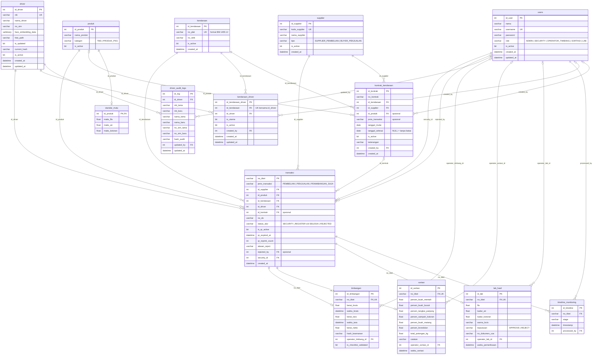

# ERD Sistem Timbangan Sawit

Database: `DbSistemTimbangan` (SQL Server). Sumber: `database/schema.sql` + `database/migrations/001_kendaraan_driver_kontrak.sql`.


Versi SVG (bisa di-zoom tanpa pecah): [erd.svg](erd.svg)

## Relasi antar tabel

Notasi: **1 : N** = one to many, **1 : 0..1** = one to zero-or-one, **M : N** = many to many.
"Opsional" berarti kolom FK boleh NULL.

### Transaksi (inti)

| Tabel induk (1) | Tabel anak (N) | Kardinalitas | Kolom FK | Arti |
|---|---|---|---|---|
| supplier | transaksi | 1 : N | `transaksi.id_supplier` | Satu supplier/buyer punya banyak tiket |
| produk | transaksi | 1 : N | `transaksi.id_produk` | Satu produk dipakai banyak tiket |
| kendaraan | transaksi | 1 : N | `transaksi.id_kendaraan` | Satu truk bisa datang berkali-kali |
| driver | transaksi | 1 : N | `transaksi.id_driver` | Satu supir membawa banyak tiket |
| kontrak_kendaraan | transaksi | 1 : N (opsional) | `transaksi.id_kontrak` | Tiket tercatat di kontrak truk-supplier yang berlaku |
| users | transaksi | 1 : N | `transaksi.security_id` | Petugas security yang membuat tiket |
| users | transaksi | 1 : N (opsional) | `transaksi.rejected_by` | Petugas yang menolak tiket |

### Detail per tahap (satu tiket, satu baris per tahap)

| Tabel induk (1) | Tabel anak | Kardinalitas | Kolom FK | Arti |
|---|---|---|---|---|
| transaksi | timbangan | 1 : 0..1 | `timbangan.no_tiket` (UNIQUE) | Data bruto / tara / netto |
| transaksi | sortasi | 1 : 0..1 | `sortasi.no_tiket` (UNIQUE) | Grading TBS, hanya produk TBS |
| transaksi | lab_hasil | 1 : 0..1 | `lab_hasil.no_tiket` (UNIQUE) | Uji mutu, hanya produk PKS |
| transaksi | timeline_monitoring | 1 : N | `timeline_monitoring.no_tiket` | Jejak waktu tiap tahap |

### Truk, supir, dan kontrak

| Tabel induk (1) | Tabel anak (N) | Kardinalitas | Kolom FK | Arti |
|---|---|---|---|---|
| kendaraan | kendaraan_driver | 1 : N | `kendaraan_driver.id_kendaraan` | Daftar supir sebuah truk |
| driver | kendaraan_driver | 1 : N | `kendaraan_driver.id_driver` | Daftar truk yang dibawa seorang supir |
| kendaraan ↔ driver | (lewat kendaraan_driver) | **M : N** | UNIQUE (`id_kendaraan`, `id_driver`) | Truk sama bisa supir beda, supir sama bisa truk beda; satu supir **utama** per truk |
| kendaraan | kontrak_kendaraan | 1 : N | `kontrak_kendaraan.id_kendaraan` | Truk bisa punya beberapa kontrak |
| supplier | kontrak_kendaraan | 1 : N | `kontrak_kendaraan.id_supplier` | Supplier bisa mengontrak banyak truk |
| kendaraan ↔ supplier | (lewat kontrak_kendaraan) | **M : N** | - | Truk sama bisa supplier beda (dengan periode kontrak) |
| produk | kontrak_kendaraan | 1 : N (opsional) | `kontrak_kendaraan.id_produk` | Produk default kontrak |

### Master lain dan audit

| Tabel induk (1) | Tabel anak | Kardinalitas | Kolom FK | Arti |
|---|---|---|---|---|
| produk | standar_mutu | 1 : 0..1 | `standar_mutu.id_produk` (PK sekaligus FK) | Batas FFA / air / kotoran per produk |
| driver | driver_audit_logs | 1 : N | `driver_audit_logs.id_driver` | Riwayat perubahan identitas supir |
| users | driver_audit_logs | 1 : N | `driver_audit_logs.updated_by` | Petugas yang mengubah data supir |

### Petugas (users) yang memproses

| Tabel anak | Kolom FK ke `users.id_user` | Kardinalitas |
|---|---|---|
| timbangan | `operator_timbang_id` | 1 : N (opsional) |
| sortasi | `operator_sortasi_id` | 1 : N (opsional) |
| lab_hasil | `operator_lab_id` | 1 : N (opsional) |
| timeline_monitoring | `processed_by` | 1 : N |
| kendaraan_driver | `created_by` | 1 : N (opsional) |
| kontrak_kendaraan | `created_by` | 1 : N (opsional) |

## Kode diagram (untuk di-copy)

### Mermaid

Bisa ditempel di [mermaid.live](https://mermaid.live), draw.io (Arrange → Insert → Advanced → Mermaid),
atau langsung di file Markdown GitHub (dibungkus ```` ```mermaid ````).



### DBML

Tempel di [dbdiagram.io](https://dbdiagram.io) untuk melihat dan mengatur posisi tabel sendiri,
lalu ekspor ke PNG / PDF / SQL.

```dbml
// Tempel di https://dbdiagram.io untuk melihat / mengedit diagram

Table users {
  id_user int [pk, increment]
  nama varchar(100) [not null]
  username varchar(50) [not null, unique]
  password varchar(255) [not null]
  role varchar(30) [not null, note: 'ADMIN | SECURITY | OPERATOR_TIMBANG | SORTASI | LAB']
  is_active bit [not null, default: 1]
  created_at datetime [not null]
  updated_at datetime [not null]
}

Table supplier {
  id_supplier int [pk, increment]
  kode_supplier varchar(20) [not null, unique]
  nama_supplier varchar(100) [not null]
  tipe varchar(30) [not null, note: 'SUPPLIER_PEMBELIAN | BUYER_PENJUALAN']
  is_active bit [not null, default: 1]
  created_at datetime [not null]
}

Table produk {
  id_produk int [pk, increment]
  nama_produk varchar(100) [not null]
  kategori varchar(20) [not null, note: 'TBS | PRODUK_PKS']
  is_active bit [not null, default: 1]
}

Table standar_mutu {
  id_produk int [pk, ref: - produk.id_produk]
  maks_ffa float [not null, default: 5.0]
  maks_air float [not null, default: 0.5]
  maks_kotoran float [not null, default: 0.5]
}

Table kendaraan {
  id_kendaraan int [pk, increment]
  no_plat varchar(15) [not null, unique, note: 'format baku: BM 1455 JJ']
  no_stnk varchar(50)
  is_active bit [not null, default: 1]
  created_at datetime [not null]
}

Table driver {
  id_driver int [pk, increment]
  nik varchar(20) [not null, unique]
  nama_driver varchar(100) [not null]
  no_sim varchar(30) [not null]
  face_embedding_data varbinary
  foto_path varchar(255)
  is_updated bit [not null, default: 0]
  current_hash varchar(64)
  is_active bit [not null, default: 1]
  created_at datetime [not null]
  updated_at datetime [not null]
}

Table driver_audit_logs {
  id_log int [pk, increment]
  id_driver int [not null, ref: > driver.id_driver]
  nik_lama varchar(20)
  nik_baru varchar(20)
  nama_lama varchar(100)
  nama_baru varchar(100)
  no_sim_lama varchar(30)
  no_sim_baru varchar(30)
  hash_audit varchar(64) [not null]
  updated_by int [not null, ref: > users.id_user]
  updated_at datetime [not null]
}

Table kendaraan_driver {
  id_kendaraan_driver int [pk, increment]
  id_kendaraan int [not null, ref: > kendaraan.id_kendaraan]
  id_driver int [not null, ref: > driver.id_driver]
  is_utama bit [not null, default: 0, note: 'supir utama truk']
  is_active bit [not null, default: 1]
  created_by int [ref: > users.id_user]
  created_at datetime [not null]
  updated_at datetime [not null]
  indexes {
    (id_kendaraan, id_driver) [unique]
  }
}

Table kontrak_kendaraan {
  id_kontrak int [pk, increment]
  no_kontrak varchar(50)
  id_kendaraan int [not null, ref: > kendaraan.id_kendaraan]
  id_supplier int [not null, ref: > supplier.id_supplier]
  id_produk int [ref: > produk.id_produk, note: 'opsional']
  jenis_transaksi varchar(20) [note: 'opsional']
  tanggal_mulai date [not null]
  tanggal_selesai date [note: 'NULL = tanpa batas']
  is_active bit [not null, default: 1]
  keterangan varchar(255)
  created_by int [ref: > users.id_user]
  created_at datetime [not null]
}

Table transaksi {
  no_tiket varchar(50) [pk]
  jenis_transaksi varchar(20) [not null, note: 'PEMBELIAN | PENJUALAN | PENIMBANGAN_SAJA']
  id_supplier int [not null, ref: > supplier.id_supplier]
  id_produk int [not null, ref: > produk.id_produk]
  id_kendaraan int [not null, ref: > kendaraan.id_kendaraan]
  id_driver int [not null, ref: > driver.id_driver]
  id_kontrak int [ref: > kontrak_kendaraan.id_kontrak, note: 'opsional']
  no_do varchar(50)
  status_alur varchar(30) [not null, default: 'SECURITY_REGISTER']
  is_qr_active bit [not null, default: 1]
  qr_expired_at datetime [not null]
  qr_reprint_count int [not null, default: 0]
  alasan_reject varchar(255)
  rejected_by int [ref: > users.id_user]
  security_id int [not null, ref: > users.id_user]
  created_at datetime [not null]
}

Table timbangan {
  id_timbangan int [pk, increment]
  no_tiket varchar(50) [not null, unique, ref: - transaksi.no_tiket]
  berat_bruto float
  waktu_bruto datetime
  berat_tara float
  waktu_tara datetime
  berat_netto float
  hash_keamanan varchar(64)
  operator_timbang_id int [ref: > users.id_user]
  is_checklist_validated bit [not null, default: 0]
}

Table sortasi {
  id_sortasi int [pk, increment]
  no_tiket varchar(50) [not null, unique, ref: - transaksi.no_tiket]
  persen_buah_mentah float
  persen_buah_busuk float
  persen_tangkai_panjang float
  persen_sampah_kotoran float
  persen_buah_matang float
  persen_brondolan float
  total_potongan_kg float
  catatan varchar(500)
  operator_sortasi_id int [ref: > users.id_user]
  waktu_sortasi datetime
}

Table lab_hasil {
  id_lab int [pk, increment]
  no_tiket varchar(50) [not null, unique, ref: - transaksi.no_tiket]
  ffa float
  kadar_air float
  kadar_kotoran float
  warna_locis varchar(50)
  keputusan varchar(20) [note: 'APPROVE | REJECT']
  no_dokumen_coa varchar(50)
  operator_lab_id int [ref: > users.id_user]
  waktu_pemeriksaan datetime
}

Table timeline_monitoring {
  id_timeline int [pk, increment]
  no_tiket varchar(50) [not null, ref: > transaksi.no_tiket]
  stage varchar(30) [not null]
  timestamp datetime [not null]
  processed_by int [not null, ref: > users.id_user]
}
```

## Membuat ulang gambar

```
npx -p @mermaid-js/mermaid-cli mmdc -i erd.mmd -o docs/erd.png -s 2 -b white
```
(salin blok Mermaid di atas ke file `erd.mmd` terlebih dulu)
