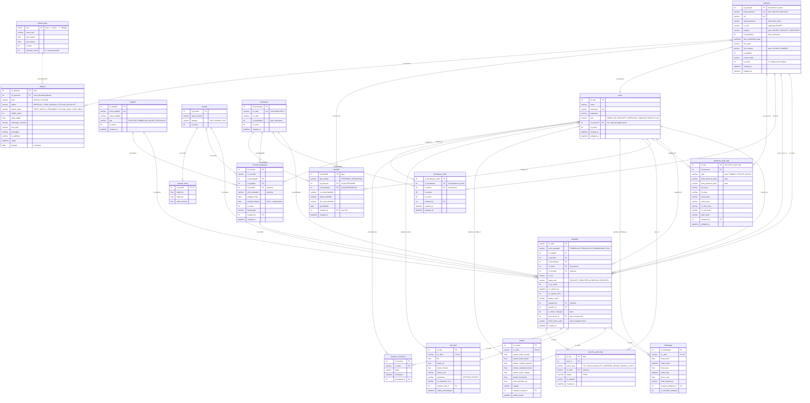

# ERD Sistem Timbangan Sawit (Weighbridge + Face Recognition)

Database: SQL Server. Sumber, dijalankan berurutan:

1. `database/schema.sql`: skema main (tabel inti tiket).
2. `database/migrations/001_kendaraan_driver_kontrak.sql`: supir truk & kontrak truk-supplier.
3. `database/migrations/002_personel_blacklist.sql`: face recognition (personel, blacklist, audit, absensi).

Untuk pengembangan, jalankan di database dummy (`DbSistemTimbangan_Test`, lihat baris `USE` di migrasi).



Versi SVG (bisa di-zoom tanpa pecah): [erd.svg](erd.svg)

## Perubahan dari migrasi 002

| Objek | Perubahan | Alasan |
|---|---|---|
| `driver` → **`personel`** | Rename tabel, `id_driver` → `id_personel`, `nama_driver` → `nama_personel` | Wajah yang dikenali bukan hanya supir, tapi juga security & karyawan HO |
| `personel` | + `kode_personel` (UK, boleh NULL), `kategori`, `is_blacklisted`, `foto_sumber`; `no_sim` boleh NULL kecuali DRIVER | Dua identitas: ID otomatis (tetap) dan Kode dari HO |
| `driver_audit_logs` → **`personel_audit_logs`** | + `aksi` (TAMBAH / UPDATE / HAPUS), `kode_personel_lama/baru` | Semua perubahan & penghapusan personel tercatat |
| `kendaraan` | + `is_blacklisted` | Truk bisa di-blacklist |
| `users` | + role **HO**, + `id_personel` (UK, opsional) | Akun login terhubung ke wajah pemiliknya |
| `transaksi` | + `is_driver_changed`, `prev_driver_id`, `driver_photo_path` | Jejak pergantian supir & snapshot wajah di pos |
| **`blacklist`** (baru) | Personel atau kendaraan, wajib no. surat | Penetapan HO, **permanen** (trigger menolak 1 → 0) |
| **`security_audit_logs`** (baru) | TRY_SCAN_BLACKLIST / OVERRIDE_DRIVER / MANUAL_INPUT | Aktivitas security yang dipantau HO (menu Audit Log) |
| **`jadwal_kerja`** (baru) | 7 baris (Senin–Minggu) | Acuan tepat waktu / terlambat, tanpa toleransi |
| **`absensi`** (baru) | Scan wajah live + liveness | Absensi personel |

Kolom FK lama `transaksi.id_driver` dan `kendaraan_driver.id_driver` **tidak di-rename** (menjaga kode Timbangan/Sortasi/Lab),
tetapi sekarang menunjuk ke `personel.id_personel`.

Hapus personel = **soft delete** (`personel.is_active = 0`): wajahnya tidak lagi dikenali, riwayat tiket/absensi tetap ada,
dan tercatat di `personel_audit_logs` dengan `aksi = 'HAPUS'`. Personel yang di-blacklist tidak bisa dihapus.

## Relasi antar tabel

Notasi: **1 : N** = one to many, **1 : 0..1** = one to zero-or-one, **M : N** = many to many.
"Opsional" berarti kolom FK boleh NULL.

### Transaksi (inti)

| Tabel induk (1) | Tabel anak (N) | Kardinalitas | Kolom FK | Arti |
|---|---|---|---|---|
| supplier | transaksi | 1 : N | `transaksi.id_supplier` | Satu supplier/buyer punya banyak tiket |
| produk | transaksi | 1 : N | `transaksi.id_produk` | Satu produk dipakai banyak tiket |
| kendaraan | transaksi | 1 : N | `transaksi.id_kendaraan` | Satu truk bisa datang berkali-kali |
| personel | transaksi | 1 : N | `transaksi.id_driver` | Satu supir membawa banyak tiket |
| personel | transaksi | 1 : N (opsional) | `transaksi.prev_driver_id` | Supir saran yang diganti saat Create Ticket |
| kontrak_kendaraan | transaksi | 1 : N (opsional) | `transaksi.id_kontrak` | Tiket tercatat di kontrak truk-supplier yang berlaku |
| users | transaksi | 1 : N | `transaksi.security_id` | Petugas security yang membuat tiket |
| users | transaksi | 1 : N (opsional) | `transaksi.rejected_by` | Petugas yang menolak tiket |

### Detail per tahap (satu tiket, satu baris per tahap)

| Tabel induk (1) | Tabel anak | Kardinalitas | Kolom FK | Arti |
|---|---|---|---|---|
| transaksi | timbangan | 1 : 0..1 | `timbangan.no_tiket` (UNIQUE) | Data bruto / tara / netto |
| transaksi | sortasi | 1 : 0..1 | `sortasi.no_tiket` (UNIQUE) | Grading TBS, hanya produk TBS |
| transaksi | lab_hasil | 1 : 0..1 | `lab_hasil.no_tiket` (UNIQUE) | Uji mutu, hanya produk PKS |
| transaksi | timeline_monitoring | 1 : N | `timeline_monitoring.no_tiket` | Jejak waktu tiap tahap |

### Truk, supir, dan kontrak

| Tabel induk (1) | Tabel anak (N) | Kardinalitas | Kolom FK | Arti |
|---|---|---|---|---|
| kendaraan | kendaraan_driver | 1 : N | `kendaraan_driver.id_kendaraan` | Daftar supir sebuah truk |
| personel | kendaraan_driver | 1 : N | `kendaraan_driver.id_driver` | Daftar truk yang dibawa seorang supir |
| kendaraan ↔ personel | (lewat kendaraan_driver) | **M : N** | UNIQUE (`id_kendaraan`, `id_driver`) | Truk sama bisa supir beda; satu supir **utama** per truk |
| kendaraan | kontrak_kendaraan | 1 : N | `kontrak_kendaraan.id_kendaraan` | Truk bisa punya beberapa kontrak |
| supplier | kontrak_kendaraan | 1 : N | `kontrak_kendaraan.id_supplier` | Supplier bisa mengontrak banyak truk |
| kendaraan ↔ supplier | (lewat kontrak_kendaraan) | **M : N** | - | Truk sama bisa supplier beda (dengan periode kontrak) |
| produk | kontrak_kendaraan | 1 : N (opsional) | `kontrak_kendaraan.id_produk` | Produk default kontrak |

### Face recognition: personel, blacklist, audit, absensi

| Tabel induk (1) | Tabel anak | Kardinalitas | Kolom FK | Arti |
|---|---|---|---|---|
| personel | personel_audit_logs | 1 : N | `personel_audit_logs.id_personel` | Riwayat tambah / ubah / hapus personel |
| users | personel_audit_logs | 1 : N | `personel_audit_logs.updated_by` | Petugas yang mengubah data personel |
| personel | users | 1 : 0..1 | `users.id_personel` (UNIQUE, opsional) | Wajah pemilik akun login |
| personel | blacklist | 1 : N (opsional) | `blacklist.id_personel` | Surat blacklist untuk personel |
| kendaraan | blacklist | 1 : N (opsional) | `blacklist.id_kendaraan` | Surat blacklist untuk truk |
| users | blacklist | 1 : N | `blacklist.created_by` | User HO yang menetapkan |
| users | security_audit_logs | 1 : N | `security_audit_logs.user_id` | Aktivitas security yang dipantau |
| transaksi | security_audit_logs | 1 : N (opsional) | `security_audit_logs.no_tiket` | Aktivitas yang terkait tiket |
| personel | absensi | 1 : N (opsional) | `absensi.id_personel` | Scan absen; NULL bila wajah tidak dikenali |
| jadwal_kerja | absensi | 1 : N (tanpa FK) | hari dari `absensi.tanggal` | Acuan jam masuk / pulang per hari |

Satu baris `blacklist` hanya untuk **satu** target: `tipe_entitas = PERSONEL` → `id_personel` terisi,
`KENDARAAN` → `id_kendaraan` terisi (dijaga `CK_Blacklist_Target`).

### Master lain

| Tabel induk (1) | Tabel anak | Kardinalitas | Kolom FK | Arti |
|---|---|---|---|---|
| produk | standar_mutu | 1 : 0..1 | `standar_mutu.id_produk` (PK sekaligus FK) | Batas FFA / air / kotoran per produk |

### Petugas (users) yang memproses

| Tabel anak | Kolom FK ke `users.id_user` | Kardinalitas |
|---|---|---|
| timbangan | `operator_timbang_id` | 1 : N (opsional) |
| sortasi | `operator_sortasi_id` | 1 : N (opsional) |
| lab_hasil | `operator_lab_id` | 1 : N (opsional) |
| timeline_monitoring | `processed_by` | 1 : N |
| kendaraan_driver | `created_by` | 1 : N (opsional) |
| kontrak_kendaraan | `created_by` | 1 : N (opsional) |

## Kode diagram (untuk di-copy)

### Mermaid

Bisa ditempel di [mermaid.live](https://mermaid.live), draw.io (Arrange → Insert → Advanced → Mermaid),
atau langsung di file Markdown GitHub (dibungkus ```` ```mermaid ````).

```mermaid
erDiagram
    users {
        int id_user PK
        varchar nama
        varchar username UK
        varchar password
        varchar role "ADMIN | HO | SECURITY | OPERATOR_TIMBANG | SORTASI | LAB"
        int id_personel FK "UK, opsional (wajah akun)"
        bit is_active
        datetime created_at
        datetime updated_at
    }
    supplier {
        int id_supplier PK
        varchar kode_supplier UK
        varchar nama_supplier
        varchar tipe "SUPPLIER_PEMBELIAN | BUYER_PENJUALAN"
        bit is_active
        datetime created_at
    }
    produk {
        int id_produk PK
        varchar nama_produk
        varchar kategori "TBS | PRODUK_PKS"
        bit is_active
    }
    standar_mutu {
        int id_produk PK, FK
        float maks_ffa
        float maks_air
        float maks_kotoran
    }
    kendaraan {
        int id_kendaraan PK
        varchar no_plat UK "format BM 1455 JJ"
        varchar no_stnk
        bit is_blacklisted "baru, permanen"
        bit is_active
        datetime created_at
    }
    personel {
        int id_personel PK "dulu driver.id_driver"
        varchar kode_personel UK "baru, diisi HO, boleh NULL"
        varchar nik UK
        varchar nama_personel "dulu nama_driver"
        varchar no_sim "wajib jika DRIVER"
        varchar kategori "baru: DRIVER | SECURITY | EMPLOYEE"
        bit is_blacklisted "baru, permanen"
        varbinary face_embedding_data
        varchar foto_path
        varchar foto_sumber "baru: UPLOAD | KAMERA"
        bit is_updated
        varchar current_hash
        bit is_active "0 = dihapus (soft delete)"
        datetime created_at
        datetime updated_at
    }
    personel_audit_logs {
        int id_log PK "dulu driver_audit_logs"
        int id_personel FK
        varchar aksi "baru: TAMBAH | UPDATE | HAPUS"
        varchar kode_personel_lama "baru"
        varchar kode_personel_baru "baru"
        varchar nik_lama
        varchar nik_baru
        varchar nama_lama
        varchar nama_baru
        varchar no_sim_lama
        varchar no_sim_baru
        varchar hash_audit
        int updated_by FK
        datetime updated_at
    }
    kendaraan_driver {
        int id_kendaraan_driver PK
        int id_kendaraan FK "UK bersama id_driver"
        int id_driver FK "ke personel"
        bit is_utama
        bit is_active
        int created_by FK
        datetime created_at
        datetime updated_at
    }
    kontrak_kendaraan {
        int id_kontrak PK
        varchar no_kontrak
        int id_kendaraan FK
        int id_supplier FK
        int id_produk FK "opsional"
        varchar jenis_transaksi "opsional"
        date tanggal_mulai
        date tanggal_selesai "NULL = tanpa batas"
        bit is_active
        varchar keterangan
        int created_by FK
        datetime created_at
    }
    transaksi {
        varchar no_tiket PK
        varchar jenis_transaksi "PEMBELIAN | PENJUALAN | PENIMBANGAN_SAJA"
        int id_supplier FK
        int id_produk FK
        int id_kendaraan FK
        int id_driver FK "ke personel"
        int id_kontrak FK "opsional"
        varchar no_do
        varchar status_alur "SECURITY_REGISTER s/d SELESAI | REJECTED"
        bit is_qr_active
        datetime qr_expired_at
        int qr_reprint_count
        varchar alasan_reject
        int rejected_by FK "opsional"
        int security_id FK
        bit is_driver_changed "baru"
        int prev_driver_id FK "baru, ke personel"
        varchar driver_photo_path "baru, snapshot di pos"
        datetime created_at
    }
    timbangan {
        int id_timbangan PK
        varchar no_tiket FK, UK
        float berat_bruto
        datetime waktu_bruto
        float berat_tara
        datetime waktu_tara
        float berat_netto
        varchar hash_keamanan
        int operator_timbang_id FK
        bit is_checklist_validated
    }
    sortasi {
        int id_sortasi PK
        varchar no_tiket FK, UK
        float persen_buah_mentah
        float persen_buah_busuk
        float persen_tangkai_panjang
        float persen_sampah_kotoran
        float persen_buah_matang
        float persen_brondolan
        float total_potongan_kg
        varchar catatan
        int operator_sortasi_id FK
        datetime waktu_sortasi
    }
    lab_hasil {
        int id_lab PK
        varchar no_tiket FK, UK
        float ffa
        float kadar_air
        float kadar_kotoran
        varchar warna_locis
        varchar keputusan "APPROVE | REJECT"
        varchar no_dokumen_coa
        int operator_lab_id FK
        datetime waktu_pemeriksaan
    }
    timeline_monitoring {
        int id_timeline PK
        varchar no_tiket FK
        varchar stage
        datetime timestamp
        int processed_by FK
    }
    blacklist {
        int id_blacklist PK "baru"
        varchar tipe_entitas "PERSONEL | KENDARAAN"
        int id_personel FK "isi jika PERSONEL"
        int id_kendaraan FK "isi jika KENDARAAN"
        varchar no_surat_blacklist
        varchar alasan_blacklist
        varchar file_surat_blacklist
        date tgl_blacklist
        int created_by FK "user HO"
        datetime created_at
    }
    security_audit_logs {
        int id_log PK "baru"
        int user_id FK
        varchar action_type "TRY_SCAN_BLACKLIST | OVERRIDE_DRIVER | MANUAL_INPUT"
        varchar no_tiket FK "opsional"
        nvarchar details "JSON"
        varchar ip_address
        datetime created_at
    }
    jadwal_kerja {
        tinyint hari PK "baru, 1 = Senin .. 7 = Minggu"
        varchar nama_hari
        time jam_masuk
        time jam_pulang
        bit is_libur
        int toleransi_menit "0 = tanpa toleransi"
    }
    absensi {
        int id_absensi PK "baru"
        int id_personel FK "NULL jika tidak dikenali"
        varchar jenis "MASUK | PULANG"
        varchar status "BERHASIL | TIDAK_DIKENALI | DITOLAK_BLACKLIST"
        varchar status_waktu "TEPAT_WAKTU | TERLAMBAT | PULANG_AWAL | HARI_LIBUR"
        int selisih_menit
        float jarak_wajah
        varchar tantangan_liveness
        varchar foto_path
        varchar perangkat
        varchar ip_address
        datetime waktu
        date tanggal "computed"
    }

    %% ---- Master -> Transaksi
    supplier  ||--o{ transaksi : "id_supplier"
    produk    ||--o{ transaksi : "id_produk"
    kendaraan ||--o{ transaksi : "id_kendaraan"
    personel  ||--o{ transaksi : "id_driver"
    personel  |o--o{ transaksi : "prev_driver_id"
    kontrak_kendaraan |o--o{ transaksi : "id_kontrak"
    users     ||--o{ transaksi : "security_id"
    users     |o--o{ transaksi : "rejected_by"

    %% ---- Transaksi -> detail per tahap
    transaksi ||--o| timbangan : "no_tiket"
    transaksi ||--o| sortasi : "no_tiket"
    transaksi ||--o| lab_hasil : "no_tiket"
    transaksi ||--o{ timeline_monitoring : "no_tiket"

    %% ---- Truk <-> Supir, kontrak
    kendaraan ||--o{ kendaraan_driver : "id_kendaraan"
    personel  ||--o{ kendaraan_driver : "id_driver"
    kendaraan ||--o{ kontrak_kendaraan : "id_kendaraan"
    supplier  ||--o{ kontrak_kendaraan : "id_supplier"
    produk    |o--o{ kontrak_kendaraan : "id_produk"

    %% ---- Master lain & audit
    produk    ||--o| standar_mutu : "id_produk"
    personel  ||--o{ personel_audit_logs : "id_personel"
    users     ||--o{ personel_audit_logs : "updated_by"
    personel  |o--o| users : "id_personel"

    %% ---- Face recognition: blacklist, audit security, absensi
    personel  |o--o{ blacklist : "id_personel"
    kendaraan |o--o{ blacklist : "id_kendaraan"
    users     ||--o{ blacklist : "created_by"
    users     ||--o{ security_audit_logs : "user_id"
    transaksi |o--o{ security_audit_logs : "no_tiket"
    personel  |o--o{ absensi : "id_personel"
    jadwal_kerja ||..o{ absensi : "hari (tanpa FK)"

    %% ---- Petugas (users) yang memproses tiap tahap
    users |o--o{ timbangan : "operator_timbang_id"
    users |o--o{ sortasi : "operator_sortasi_id"
    users |o--o{ lab_hasil : "operator_lab_id"
    users ||--o{ timeline_monitoring : "processed_by"
    users |o--o{ kendaraan_driver : "created_by"
    users |o--o{ kontrak_kendaraan : "created_by"
```



### DBML

Tempel di [dbdiagram.io](https://dbdiagram.io) untuk melihat dan mengatur posisi tabel sendiri,
lalu ekspor ke PNG / PDF / SQL.

```dbml
// Tempel di https://dbdiagram.io untuk melihat / mengedit diagram

Table users {
  id_user int [pk, increment]
  nama varchar(100) [not null]
  username varchar(50) [not null, unique]
  password varchar(255) [not null]
  role varchar(30) [not null, note: 'ADMIN | HO | SECURITY | OPERATOR_TIMBANG | SORTASI | LAB']
  id_personel int [unique, ref: - personel.id_personel, note: 'wajah pemilik akun (opsional)']
  is_active bit [not null, default: 1]
  created_at datetime [not null]
  updated_at datetime [not null]
}

Table supplier {
  id_supplier int [pk, increment]
  kode_supplier varchar(20) [not null, unique]
  nama_supplier varchar(100) [not null]
  tipe varchar(30) [not null, note: 'SUPPLIER_PEMBELIAN | BUYER_PENJUALAN']
  is_active bit [not null, default: 1]
  created_at datetime [not null]
}

Table produk {
  id_produk int [pk, increment]
  nama_produk varchar(100) [not null]
  kategori varchar(20) [not null, note: 'TBS | PRODUK_PKS']
  is_active bit [not null, default: 1]
}

Table standar_mutu {
  id_produk int [pk, ref: - produk.id_produk]
  maks_ffa float [not null, default: 5.0]
  maks_air float [not null, default: 0.5]
  maks_kotoran float [not null, default: 0.5]
}

Table kendaraan {
  id_kendaraan int [pk, increment]
  no_plat varchar(15) [not null, unique, note: 'format baku: BM 1455 JJ']
  no_stnk varchar(50)
  is_blacklisted bit [not null, default: 0, note: 'permanen (trigger)']
  is_active bit [not null, default: 1]
  created_at datetime [not null]
}

Table personel {
  id_personel int [pk, increment, note: 'dulu driver.id_driver, tidak pernah berubah']
  kode_personel varchar(20) [unique, note: 'diisi/diubah HO, boleh NULL, mis. PRGBS-001']
  nik varchar(20) [not null, unique]
  nama_personel varchar(100) [not null, note: 'dulu nama_driver']
  no_sim varchar(30) [note: 'wajib jika kategori DRIVER']
  kategori varchar(20) [not null, default: 'DRIVER', note: 'DRIVER | SECURITY | EMPLOYEE']
  is_blacklisted bit [not null, default: 0, note: 'permanen (trigger)']
  foto_sumber varchar(10) [note: 'UPLOAD | KAMERA']
  face_embedding_data varbinary
  foto_path varchar(255)
  is_updated bit [not null, default: 0]
  current_hash varchar(64)
  is_active bit [not null, default: 1]
  created_at datetime [not null]
  updated_at datetime [not null]
}

Table personel_audit_logs {
  id_log int [pk, increment]
  id_personel int [not null, ref: > personel.id_personel]
  aksi varchar(10) [not null, default: 'UPDATE', note: 'TAMBAH | UPDATE | HAPUS']
  kode_personel_lama varchar(20)
  kode_personel_baru varchar(20)
  nik_lama varchar(20)
  nik_baru varchar(20)
  nama_lama varchar(100)
  nama_baru varchar(100)
  no_sim_lama varchar(30)
  no_sim_baru varchar(30)
  hash_audit varchar(64) [not null]
  updated_by int [not null, ref: > users.id_user]
  updated_at datetime [not null]
}

Table kendaraan_driver {
  id_kendaraan_driver int [pk, increment]
  id_kendaraan int [not null, ref: > kendaraan.id_kendaraan]
  id_driver int [not null, ref: > personel.id_personel, note: 'ke personel']
  is_utama bit [not null, default: 0, note: 'supir utama truk']
  is_active bit [not null, default: 1]
  created_by int [ref: > users.id_user]
  created_at datetime [not null]
  updated_at datetime [not null]
  indexes {
    (id_kendaraan, id_driver) [unique]
  }
}

Table kontrak_kendaraan {
  id_kontrak int [pk, increment]
  no_kontrak varchar(50)
  id_kendaraan int [not null, ref: > kendaraan.id_kendaraan]
  id_supplier int [not null, ref: > supplier.id_supplier]
  id_produk int [ref: > produk.id_produk, note: 'opsional']
  jenis_transaksi varchar(20) [note: 'opsional']
  tanggal_mulai date [not null]
  tanggal_selesai date [note: 'NULL = tanpa batas']
  is_active bit [not null, default: 1]
  keterangan varchar(255)
  created_by int [ref: > users.id_user]
  created_at datetime [not null]
}

Table transaksi {
  no_tiket varchar(50) [pk]
  jenis_transaksi varchar(20) [not null, note: 'PEMBELIAN | PENJUALAN | PENIMBANGAN_SAJA']
  id_supplier int [not null, ref: > supplier.id_supplier]
  id_produk int [not null, ref: > produk.id_produk]
  id_kendaraan int [not null, ref: > kendaraan.id_kendaraan]
  id_driver int [not null, ref: > personel.id_personel, note: 'ke personel']
  id_kontrak int [ref: > kontrak_kendaraan.id_kontrak, note: 'opsional']
  no_do varchar(50)
  status_alur varchar(30) [not null, default: 'SECURITY_REGISTER']
  is_qr_active bit [not null, default: 1]
  qr_expired_at datetime [not null]
  qr_reprint_count int [not null, default: 0]
  alasan_reject varchar(255)
  rejected_by int [ref: > users.id_user]
  security_id int [not null, ref: > users.id_user]
  is_driver_changed bit [not null, default: 0, note: 'supir beda dari saran/utama']
  prev_driver_id int [ref: > personel.id_personel, note: 'supir yang disarankan sebelumnya']
  driver_photo_path varchar(255) [note: 'snapshot wajah di pos']
  created_at datetime [not null]
}

Table timbangan {
  id_timbangan int [pk, increment]
  no_tiket varchar(50) [not null, unique, ref: - transaksi.no_tiket]
  berat_bruto float
  waktu_bruto datetime
  berat_tara float
  waktu_tara datetime
  berat_netto float
  hash_keamanan varchar(64)
  operator_timbang_id int [ref: > users.id_user]
  is_checklist_validated bit [not null, default: 0]
}

Table sortasi {
  id_sortasi int [pk, increment]
  no_tiket varchar(50) [not null, unique, ref: - transaksi.no_tiket]
  persen_buah_mentah float
  persen_buah_busuk float
  persen_tangkai_panjang float
  persen_sampah_kotoran float
  persen_buah_matang float
  persen_brondolan float
  total_potongan_kg float
  catatan varchar(500)
  operator_sortasi_id int [ref: > users.id_user]
  waktu_sortasi datetime
}

Table lab_hasil {
  id_lab int [pk, increment]
  no_tiket varchar(50) [not null, unique, ref: - transaksi.no_tiket]
  ffa float
  kadar_air float
  kadar_kotoran float
  warna_locis varchar(50)
  keputusan varchar(20) [note: 'APPROVE | REJECT']
  no_dokumen_coa varchar(50)
  operator_lab_id int [ref: > users.id_user]
  waktu_pemeriksaan datetime
}

Table timeline_monitoring {
  id_timeline int [pk, increment]
  no_tiket varchar(50) [not null, ref: > transaksi.no_tiket]
  stage varchar(30) [not null]
  timestamp datetime [not null]
  processed_by int [not null, ref: > users.id_user]
}

Table blacklist {
  id_blacklist int [pk, increment]
  tipe_entitas varchar(20) [not null, note: 'PERSONEL | KENDARAAN']
  id_personel int [ref: > personel.id_personel, note: 'isi jika PERSONEL']
  id_kendaraan int [ref: > kendaraan.id_kendaraan, note: 'isi jika KENDARAAN']
  no_surat_blacklist varchar(50) [not null]
  alasan_blacklist varchar(500) [not null]
  file_surat_blacklist varchar(255)
  tgl_blacklist date [not null]
  created_by int [not null, ref: > users.id_user]
  created_at datetime [not null]
}

Table security_audit_logs {
  id_log int [pk, increment]
  user_id int [not null, ref: > users.id_user]
  action_type varchar(30) [not null, note: 'TRY_SCAN_BLACKLIST | OVERRIDE_DRIVER | MANUAL_INPUT']
  no_tiket varchar(50) [ref: > transaksi.no_tiket]
  details nvarchar [note: 'JSON']
  ip_address varchar(45)
  created_at datetime [not null]
}

Table jadwal_kerja {
  hari tinyint [pk, note: '1 = Senin .. 7 = Minggu']
  nama_hari varchar(10) [not null]
  jam_masuk time
  jam_pulang time
  is_libur bit [not null, default: 0]
  toleransi_menit int [not null, default: 0]
}

Table absensi {
  id_absensi int [pk, increment]
  id_personel int [ref: > personel.id_personel, note: 'NULL jika tidak dikenali']
  jenis varchar(10) [note: 'MASUK | PULANG']
  status varchar(20) [not null, note: 'BERHASIL | TIDAK_DIKENALI | DITOLAK_BLACKLIST']
  status_waktu varchar(20) [note: 'TEPAT_WAKTU | TERLAMBAT | PULANG_AWAL | HARI_LIBUR']
  selisih_menit int
  jarak_wajah float
  tantangan_liveness varchar(20)
  foto_path varchar(255)
  perangkat varchar(50)
  ip_address varchar(45)
  waktu datetime [not null]
  tanggal date [note: 'computed: CAST(waktu AS DATE)']
}
```

## Membuat ulang gambar

```
npx -p @mermaid-js/mermaid-cli mmdc -i erd.mmd -o docs/erd.png -s 2 -b white
npx -p @mermaid-js/mermaid-cli mmdc -i erd.mmd -o docs/erd.svg -b white
```
(salin blok Mermaid di atas ke file `erd.mmd` terlebih dulu)
