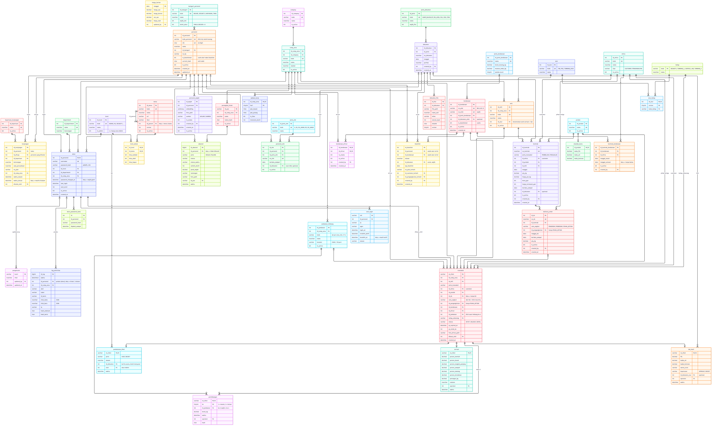

# ERD v3 (DRAF untuk ditinjau)

Status: **draf**, belum ada perubahan database / kode. Setelah disetujui baru dibuat migrasi per fase.
Database: SQL Server 2022 (JSON disimpan di `NVARCHAR(MAX)` + `CHECK (ISJSON(...) = 1)`).

 · versi zoom: [erd_v3.svg](erd_v3.svg)

## Prinsip

1. **Aturan disimpan di data, bukan di `if`**: hak akses (`level_akses`), alur tahap (`alur_tahap`), jenis dokumen,
   kategori personel, jenis SIM, keperluan tamu. Menambah role / alur / jenis dokumen = tambah baris, tanpa ubah kode.
2. **Kolom yang hanya dimiliki sebagian baris dipisah** (SIM, wajah, akun login, pembatalan tiket, penimbangan ke-2).
   NULL yang tersisa hanya yang memang bermakna, mis. `waktu_keluar` (tamu masih di dalam), `berakhir_at` (sesi masih aktif).
3. **Satu sumber kebenaran**: orang hanya di `personel`, blacklist hanya di `blacklist`, file hanya di `dokumen_file`,
   riwayat perubahan hanya di `log_aktivitas`.
4. **Angka turunan tidak disimpan**: netto, realisasi / sisa DO dihitung lewat view.
5. Semua role (selain ADMIN) **melihat semua menu**; yang dibedakan hanya aksi tambah / ubah / hapus.

## Ringkasan perubahan dari v2 (yang sekarang)

| v2 | v3 | Alasan |
|---|---|---|
| `users` (role teks) | `akun` 1 : 0..1 `personel` + `level`, `department`, `comp_area` | Data orang tidak dobel; driver & tamu tidak punya kolom login NULL |
| `role_required('SECURITY')` di kode | `menu` + `level_akses` | Hak akses diatur Admin dari layar matriks |
| `personel.no_sim`, `kategori` teks | `personel_sim` + `jenis_sim`, `kategori_personel` | SIM hanya driver, bisa > 1, ada masa berlaku |
| `personel.face_embedding_data`, `foto_path`, `foto_sumber` | `personel_wajah` | Bisa beberapa foto / embedding, riwayat tidak hilang |
| – | `kunjungan` + `keperluan_kunjungan` | Tamu = personel kategori TAMU (tanpa akun), scan wajah tiap datang, dicatat dengan orang yang dituju |
| `supplier` | `mitra` | Isinya customer & pengangkutan, bukan hanya supplier |
| `delivery_order.no_kontrak` (teks), `id_customer`, `id_produk`, `jenis_transaksi` | `kontrak` (1 kontrak 1 produk) → `delivery_order` (FK) | Customer, produk, harga, qty ada di kontrak; DO (= nomor pengangkutan) tinggal menunjuk kontrak |
| `id_pengangkutan` (NULL = customer sendiri) | `cara_angkut` PENGIRIM / PENERIMA / PIHAK_KETIGA + `id_pengangkutan` hanya untuk pihak ketiga | 3 kemungkinan pengangkutan tercatat jelas |
| `kendaraan.no_stnk` boleh kosong | wajib & unik | Setiap kendaraan terdaftar wajib STNK |
| `jadwal_kerja` (satu untuk semua) | per area (`id_comp_area`, `hari`) | Jam kerja tiap site bisa berbeda |
| `transaksi.no_do` (teks) | `transaksi.id_do` FK | Integritas data |
| status_alur di kode (TBS → sortasi, PKS → lab) | `mill` → `alur` → `alur_tahap` | Arah tahap ditentukan data |
| `timbangan` (bruto + tara dalam 1 baris, tara NULL sebelum keluar) | `penimbangan` (baris ke-1 & ke-2) + `jembatan_timbang` | Tanpa NULL; masuk & keluar wajib di jembatan yang sama |
| `transaksi.alasan_void`, `void_by`, `void_at`, `alasan_reject`, `rejected_by` | `pembatalan_tiket` | Kolom NULL di hampir semua tiket. Void tetap oleh Admin; berita acara boleh menyusul |
| `blacklist.file_surat_blacklist` | `dokumen` + `dokumen_file` (`jenis_dokumen`) | Satu tempat untuk surat blacklist, BA void, COA, scan SIM / STNK |
| `admin_audit_logs`, `security_audit_logs`, `personel_audit_logs`, `standar_mutu_log`, `timeline_monitoring` | `log_aktivitas` (JSON + rantai hash) | Satu riwayat untuk semua |
| `transaksi.is_driver_changed`, `prev_driver_id` | `log_aktivitas` (aksi `GANTI_DRIVER`) | Jarang terisi |
| – | `jenis_kendaraan` | Berat kosong & muatan maks untuk cek overload |

## Diagram (Mermaid)

```mermaid
erDiagram
    %% ===== ORGANISASI & AKSES =====
    company {
        int id_company PK
        varchar kode UK
        nvarchar nama
        bit is_active
    }
    comp_area {
        int id_comp_area PK
        int id_company FK
        varchar kode UK
        nvarchar nama
        nvarchar alamat
        bit is_active
    }
    mill {
        int id_mill PK
        int id_comp_area FK
        varchar kode UK
        nvarchar nama
        int id_alur FK "menentukan arah sortasi / lab"
        bit is_active
    }
    jembatan_timbang {
        int id_jembatan PK
        int id_comp_area FK
        varchar kode "UK per area, mis. JT-1"
        nvarchar nama
        varchar koneksi "COM3 / IP:port"
        bit is_active
    }
    department {
        int id_department PK
        nvarchar nama UK
        nvarchar keterangan
    }
    level {
        int id_level PK
        varchar kode UK "ADMIN, HO, SECURITY, ..."
        nvarchar nama
        bit is_admin "1 = hanya area Admin"
    }
    menu {
        int id_menu PK
        varchar kode UK
        nvarchar nama
        varchar url
        varchar ikon
        int id_parent FK "NULL = menu utama"
        int urutan
        bit is_active
    }
    level_akses {
        int id_level PK, FK
        int id_menu PK, FK
        bit bisa_tambah
        bit bisa_ubah
        bit bisa_hapus
    }
    akun {
        int id_personel PK, FK
        varchar username UK
        varchar password_hash "pbkdf2, 255"
        int id_level FK
        int id_department FK
        int id_comp_area FK
        datetime password_changed_at "NULL = wajib ganti"
        datetime last_login
        int sesi_versi
        bit is_active
        datetime created_at
    }
    akun_password_lama {
        int id PK
        int id_personel FK
        varchar password_hash
        datetime dipakai_sampai
    }
    sesi_login {
        varchar sid PK
        int id_personel FK
        varchar ip
        varchar agen
        datetime login_at
        datetime terakhir_aktif
        datetime berakhir_at "NULL = masih aktif"
        varchar alasan
    }
    perangkat_kiosk {
        varchar id_pos PK
        int id_comp_area FK
        nvarchar nama
        char token_hash
        bit is_active
    }
    pengaturan {
        varchar kunci PK
        nvarchar nilai
        int updated_by FK
        datetime updated_at
    }

    %% ===== PERSONEL =====
    kategori_personel {
        int id_kategori PK
        varchar kode UK "DRIVER, SECURITY, KARYAWAN, TAMU"
        nvarchar nama
        bit wajib_sim
        bit boleh_akun "TAMU & DRIVER = 0"
    }
    personel {
        int id_personel PK
        varchar kode_personel UK "diisi HO, boleh kosong"
        char nik UK "16 digit"
        nvarchar nama
        int id_kategori FK
        varchar no_hp
        bit is_blacklisted "cache dari tabel blacklist"
        char current_hash "anti-ubah"
        bit is_active
        datetime created_at
        datetime updated_at
    }
    jenis_sim {
        int id_jenis_sim PK
        varchar kode UK "A, B1, B1_UMUM, B2, B2_UMUM"
        nvarchar nama
    }
    personel_sim {
        int id_sim PK
        int id_personel FK
        int id_jenis_sim FK
        varchar no_sim UK
        date berlaku_sampai
        int id_dokumen FK "scan SIM, opsional"
        bit is_active
    }
    personel_wajah {
        int id_wajah PK
        int id_personel FK
        varbinary embedding
        varchar foto_path
        varchar sumber "UPLOAD | KAMERA"
        bit is_utama
        int created_by FK
        datetime created_at
        bit is_active
    }
    keperluan_kunjungan {
        int id_keperluan PK
        nvarchar nama UK
        bit is_active
    }
    kunjungan {
        int id_kunjungan PK
        int id_personel FK "tamu"
        int id_dituju FK "personel yang ditemui"
        int id_keperluan FK
        nvarchar keterangan
        nvarchar asal_perusahaan
        varchar no_plat
        int id_comp_area FK
        datetime waktu_masuk
        datetime waktu_keluar "NULL = masih di dalam"
        int dicatat_oleh FK
    }
    jadwal_kerja {
        int id_comp_area PK, FK
        tinyint hari PK
        time jam_masuk
        time jam_pulang
        bit is_libur
        int toleransi_menit
    }
    absensi {
        bigint id_absensi PK
        int id_personel FK "NULL = tidak dikenali"
        varchar jenis "MASUK | PULANG"
        varchar status
        varchar status_waktu
        int selisih_menit
        decimal jarak_wajah
        varchar tantangan
        varchar foto_path
        varchar id_pos FK
        datetime waktu
    }

    %% ===== KENDARAAN & MITRA =====
    jenis_kendaraan {
        int id_jenis_kendaraan PK
        nvarchar nama UK
        decimal berat_kosong_kg
        decimal muatan_maks_kg
        tinyint jumlah_kursi
    }
    kendaraan {
        int id_kendaraan PK
        varchar no_plat UK "BM 1455 JJ"
        varchar no_stnk UK "wajib"
        int id_jenis_kendaraan FK
        int id_dokumen_stnk FK "opsional"
        bit is_blacklisted "cache"
        bit is_active
        datetime created_at
    }
    kendaraan_driver {
        int id_kendaraan PK, FK
        int id_driver PK, FK
        bit is_utama
        bit is_active
        int created_by FK
        datetime created_at
    }
    mitra {
        int id_mitra PK
        varchar kode UK
        nvarchar nama
        varchar tipe "CUSTOMER | PENGANGKUTAN"
        bit is_active
    }
    kontrak_kendaraan {
        int id_kontrak_kendaraan PK
        int id_kendaraan FK
        int id_mitra FK
        date tanggal_mulai
        date tanggal_selesai "NULL = tanpa batas"
        bit is_active
        int created_by FK
    }

    %% ===== KONTRAK, DO, PRODUK =====
    produk {
        int id_produk PK
        nvarchar nama UK
        bit is_active
    }
    standar_mutu {
        int id_produk PK, FK
        decimal maks_ffa
        decimal maks_air
        decimal maks_kotoran
    }
    kontrak {
        int id_kontrak PK
        nvarchar no_kontrak UK
        varchar jenis_transaksi "PEMBELIAN | PENJUALAN"
        int id_mitra FK "customer"
        int id_produk FK
        int id_mill FK
        date tanggal
        decimal qty_kg
        decimal harga_per_kg
        bit kena_ppn
        bit harga_termasuk_ppn
        date berlaku_sampai
        int id_dokumen FK "opsional"
        bit is_active
        int created_by FK
        datetime created_at
    }
    delivery_order {
        int id_do PK
        nvarchar no_do UK
        int id_kontrak FK
        varchar cara_angkut "PENGIRIM | PENERIMA | PIHAK_KETIGA"
        int id_pengangkutan FK "hanya PIHAK_KETIGA"
        date tanggal_do
        date berlaku_sampai
        decimal qty_kg
        bit is_active
        int created_by FK
        datetime created_at
    }
    harga_harian {
        date tanggal PK
        decimal harga_cpo
        decimal harga_kernel
        decimal oer_cpo
        decimal biaya_olah
        int updated_by FK
    }

    %% ===== PROSES TIKET =====
    alur {
        int id_alur PK
        varchar kode UK "TBS, PKS, TIMBANG_SAJA"
        nvarchar nama
    }
    tahap {
        varchar kode PK "SECURITY, TIMBANG_1, SORTASI, LAB, TIMBANG_2"
        nvarchar nama
    }
    alur_tahap {
        int id_alur PK, FK
        tinyint urutan PK
        varchar kode_tahap FK
    }
    transaksi {
        varchar no_tiket PK
        int id_comp_area FK
        int id_mill FK
        varchar jenis_transaksi
        int id_mitra FK "customer"
        int id_produk FK
        int id_do FK "NULL = tanpa DO"
        varchar cara_angkut "dari DO / diisi Security"
        int id_pengangkutan FK "hanya PIHAK_KETIGA"
        int id_kendaraan FK
        int id_driver FK
        int id_jembatan FK "diisi saat timbang ke-1"
        varchar tahap_sekarang FK
        varchar status "AKTIF | SELESAI | BATAL"
        datetime qr_expired_at
        int qr_cetak_ke
        varchar foto_driver_path
        int dibuat_oleh FK
        datetime created_at
    }
    penimbangan {
        varchar no_tiket PK, FK
        tinyint ke PK "1 = masuk, 2 = keluar"
        int id_jembatan FK "ke-2 wajib = ke-1"
        decimal berat_kg
        datetime waktu
        int operator FK
        char hash
    }
    sortasi {
        varchar no_tiket PK, FK
        decimal persen_mentah
        decimal persen_busuk
        decimal persen_tangkai_panjang
        decimal persen_sampah
        decimal persen_matang
        decimal persen_brondolan
        decimal potongan_kg
        nvarchar catatan
        int operator FK
        datetime waktu
    }
    lab_hasil {
        varchar no_tiket PK, FK
        decimal ffa
        decimal kadar_air
        decimal kadar_kotoran
        varchar warna_locis
        varchar keputusan "APPROVE | REJECT"
        int id_dokumen_coa FK "opsional"
        int operator FK
        datetime waktu
    }
    pembatalan_tiket {
        varchar no_tiket PK, FK
        varchar jenis "VOID | REJECT"
        nvarchar alasan
        int id_dokumen FK "berita acara, boleh menyusul"
        int oleh FK "akun Admin"
        datetime waktu
    }

    %% ===== BLACKLIST, DOKUMEN, LOG =====
    jenis_dokumen {
        int id_jenis PK
        varchar kode UK "SURAT_BLACKLIST, BA_VOID, COA, SIM, STNK"
        nvarchar nama
        bit wajib_file
    }
    dokumen {
        int id_dokumen PK
        int id_jenis FK
        nvarchar no_dokumen
        date tanggal
        nvarchar perihal
        int created_by FK
        datetime created_at
    }
    dokumen_file {
        int id_file PK
        int id_dokumen FK
        varchar file_path
        nvarchar nama_asli
        varchar mime
        int ukuran_byte
        char sha256
        tinyint urutan
    }
    blacklist {
        int id_blacklist PK
        int id_personel FK "salah satu terisi"
        int id_kendaraan FK "salah satu terisi"
        nvarchar alasan
        int id_dokumen FK "surat, wajib"
        date tgl_blacklist
        varchar no_plat_terkait
        int id_customer_terkait FK
        int id_pengangkutan_terkait FK
        int created_by FK
        datetime created_at
    }
    log_aktivitas {
        bigint id_log PK
        datetime2 waktu
        int id_personel FK "pelaku (akun), NULL = kiosk / sistem"
        int id_comp_area FK
        varchar aksi
        varchar tabel
        varchar id_baris
        nvarchar nilai_lama "JSON"
        nvarchar nilai_baru "JSON"
        varchar ip
        char hash_sebelum
        char hash_baris
    }

    %% ===== RELASI =====
    company ||--o{ comp_area : ""
    comp_area ||--o{ mill : ""
    comp_area ||--o{ jembatan_timbang : ""
    comp_area ||--o{ perangkat_kiosk : ""
    alur ||--o{ mill : ""
    level ||--o{ level_akses : ""
    menu ||--o{ level_akses : ""
    menu |o--o{ menu : "id_parent"
    personel ||--o| akun : "login"
    level ||--o{ akun : ""
    department ||--o{ akun : ""
    comp_area ||--o{ akun : ""
    akun ||--o{ akun_password_lama : ""
    akun ||--o{ sesi_login : ""
    akun |o--o{ pengaturan : "updated_by"

    kategori_personel ||--o{ personel : ""
    personel ||--o{ personel_sim : ""
    jenis_sim ||--o{ personel_sim : ""
    personel ||--o{ personel_wajah : ""
    personel ||--o{ kunjungan : "tamu"
    personel ||--o{ kunjungan : "dituju"
    keperluan_kunjungan ||--o{ kunjungan : ""
    personel |o--o{ absensi : ""
    comp_area ||--o{ jadwal_kerja : ""
    mitra |o--o{ transaksi : "pihak ketiga"
    perangkat_kiosk ||--o{ absensi : ""

    jenis_kendaraan |o--o{ kendaraan : ""
    kendaraan ||--o{ kendaraan_driver : ""
    personel ||--o{ kendaraan_driver : "driver"
    kendaraan ||--o{ kontrak_kendaraan : ""
    mitra ||--o{ kontrak_kendaraan : ""

    produk ||--o| standar_mutu : ""
    mitra ||--o{ kontrak : "customer"
    produk ||--o{ kontrak : ""
    mill ||--o{ kontrak : ""
    kontrak ||--o{ delivery_order : ""
    mitra |o--o{ delivery_order : "pihak ketiga"

    alur ||--o{ alur_tahap : ""
    tahap ||--o{ alur_tahap : ""
    comp_area ||--o{ transaksi : ""
    mill ||--o{ transaksi : ""
    mitra ||--o{ transaksi : "customer"
    produk ||--o{ transaksi : ""
    delivery_order |o--o{ transaksi : ""
    kendaraan ||--o{ transaksi : ""
    personel ||--o{ transaksi : "driver"
    jembatan_timbang |o--o{ transaksi : ""
    tahap ||--o{ transaksi : "tahap_sekarang"
    akun ||--o{ transaksi : "dibuat_oleh"
    transaksi ||--o{ penimbangan : "maks 2"
    jembatan_timbang ||--o{ penimbangan : ""
    transaksi ||--o| sortasi : ""
    transaksi ||--o| lab_hasil : ""
    transaksi ||--o| pembatalan_tiket : ""

    jenis_dokumen ||--o{ dokumen : ""
    dokumen ||--|{ dokumen_file : ""
    dokumen ||--o{ blacklist : "surat"
    dokumen |o--o{ pembatalan_tiket : "BA"
    dokumen |o--o{ lab_hasil : "COA"
    dokumen |o--o{ personel_sim : "scan"
    dokumen |o--o{ kontrak : ""
    personel |o--o{ blacklist : ""
    kendaraan |o--o{ blacklist : ""
    akun |o--o{ log_aktivitas : "pelaku"
```

## Aturan penting (constraint / trigger)

| Tabel | Aturan |
|---|---|
| `akun` | `id_personel` = PK sekaligus FK → satu orang maksimal satu akun. Hanya personel dengan `kategori_personel.boleh_akun = 1` (Security, Karyawan); tamu & driver tidak punya akun. Hak akses ditentukan `level`, bukan kategori |
| `delivery_order`, `transaksi` | `CHECK ((cara_angkut = 'PIHAK_KETIGA') = (id_pengangkutan IS NOT NULL))`. Pengirim / penerima mengikuti jenis transaksi: PEMBELIAN → pengirim = mitra, penerima = PT kita; PENJUALAN → sebaliknya |
| `kendaraan` | `no_stnk` NOT NULL + UNIQUE |
| `jadwal_kerja` | Absensi dinilai dengan jadwal area tempat scan (`perangkat_kiosk.id_comp_area`) |
| `personel_sim` | Wajib minimal 1 SIM aktif bila `kategori_personel.wajib_sim = 1` (dicek aplikasi saat simpan driver) |
| `personel_wajah` | Maks 1 `is_utama = 1` per personel (filtered unique index) |
| `blacklist` | `CHECK ((id_personel IS NULL) <> (id_kendaraan IS NULL))`; permanen (trigger menolak UPDATE / DELETE); trigger mengisi `is_blacklisted` di `personel` / `kendaraan` |
| `penimbangan` | `CHECK (ke IN (1, 2))`; trigger: `ke = 2` wajib `id_jembatan` sama dengan `ke = 1`, dan `transaksi.id_jembatan` diisi saat `ke = 1` |
| `transaksi` | Tahap berikutnya = baris `alur_tahap` setelah `tahap_sekarang` pada alur milik `mill` tiket |
| `pembatalan_tiket` | VOID oleh Admin seperti sekarang (wajib alasan). `id_dokumen` (berita acara) boleh menyusul |
| `dokumen` | Minimal satu `dokumen_file` bila `jenis_dokumen.wajib_file = 1`; `sha256` dihitung saat upload |
| `log_aktivitas` | Hanya INSERT (trigger menolak UPDATE / DELETE). `hash_baris = SHA256(hash_sebelum + isi baris)` → baris yang diubah / dihapus ketahuan |
| JSON | `nilai_lama`, `nilai_baru`: `CHECK (ISJSON(...) = 1)`; yang sering dicari (aksi, tabel, id_baris, waktu) kolom biasa + index |

## View (angka turunan, tidak disimpan)

| View | Isi |
|---|---|
| `v_tiket_berat` | Per tiket: berat ke-1, ke-2, bruto = maks, tara = min, netto = selisih, netto akhir = netto − potongan sortasi |
| `v_do_realisasi` | Per DO: qty, realisasi = jumlah netto akhir tiket SELESAI, sisa |
| `v_kontrak_realisasi` | Per kontrak: qty, realisasi semua DO-nya, sisa |
| `v_hak_akses` | Per akun: menu + aksi yang boleh (dipakai aplikasi, di-cache ±30 detik) |

## Isi awal master

**level** (sama dengan role sekarang): ADMIN (is_admin = 1), HO, SECURITY, OPERATOR_TIMBANG, SORTASI, LAB.

**level_akses** (meniru hak akses sekarang; semua level non-admin melihat semua menu):

| Menu | HO | SECURITY | OPERATOR_TIMBANG | SORTASI | LAB |
|---|---|---|---|---|---|
| DASHBOARD (harga harian) | ubah | – | – | – | – |
| FORM_SECURITY (buat tiket, supir truk) | – | tambah, ubah | – | – | – |
| FORM_TIMBANGAN | – | – | tambah | – | – |
| FORM_SORTASI | – | – | – | tambah | – |
| FORM_LAB (hasil lab, standar mutu) | – | – | – | – | tambah, ubah |
| PERSONEL (semua kategori) | tambah, ubah, hapus | – | – | – | – |
| BLACKLIST | tambah | – | – | – | – |
| KONTRAK_DO | tambah, ubah, hapus | – | – | – | – |
| MASTER_DRIVER | tambah, ubah, hapus | tambah, ubah, hapus | – | – | – |
| MASTER_KENDARAAN | tambah, ubah | tambah, ubah | – | – | – |
| KUNJUNGAN (tamu, baru) | – | tambah, ubah | – | – | – |
| LIST, ABSENSI, AUDIT_LOG | lihat | lihat | lihat | lihat | lihat |

ADMIN: semua menu `ADMIN_*` (Kelola User, Hak Akses (baru), Sesi Aktif, Master, Void Tiket, Jadwal,
Pengaturan, Perangkat, Log, Kesehatan). Void tiket tetap di menu Admin seperti sekarang.

**alur / alur_tahap**

| Alur | Urutan tahap |
|---|---|
| TBS | SECURITY → TIMBANG_1 → SORTASI → TIMBANG_2 |
| PKS | SECURITY → TIMBANG_1 → LAB → TIMBANG_2 |
| TIMBANG_SAJA | SECURITY → TIMBANG_1 → TIMBANG_2 |

**kategori_personel**: DRIVER (wajib_sim, tanpa akun), SECURITY (boleh akun), KARYAWAN (boleh akun), TAMU (tanpa akun).

**Alur tamu**: Security mendaftarkan tamu sebagai personel kategori TAMU + foto wajah (`personel_wajah`). Setiap datang, scan wajah → baris `kunjungan` (orang yang dituju, keperluan); keluar → `waktu_keluar` diisi.
**jenis_sim**: A, B1, B1_UMUM, B2, B2_UMUM.
**jenis_dokumen**: SURAT_BLACKLIST (wajib file), BA_VOID (wajib file), COA, SIM, STNK, KONTRAK.
**keperluan_kunjungan**: Rapat, Pengiriman Barang, Perbaikan / Servis, Audit, Lainnya.

## Dampak ke kode (ringkas)

| Bagian | Sekarang | Nanti |
|---|---|---|
| Hak akses | `@role_required('SECURITY')` (25 tempat) | `@izin('FORM_SECURITY', 'tambah')`; sidebar dari tabel `menu`; Admin › Hak Akses (matriks centang) |
| Login | `users` | `akun` JOIN `personel` (nama, foto) |
| Scan wajah | `personel.face_embedding_data` | `personel_wajah` (semua embedding aktif) |
| Tahap tiket | `if kategori == 'TBS'` | baca `alur_tahap` |
| Timbang | 1 port COM, 1 baris `timbangan` | per `jembatan_timbang` (PC operator memilih jembatan), 2 baris `penimbangan` |
| Upload surat | path di kolom tabel | `dokumen` + `dokumen_file` (satu fungsi upload untuk semua jenis) |
| Audit | 4 fungsi / tabel | `catat_log(aksi, tabel, id, lama, baru)` |

## Rencana migrasi

| Fase | Isi | Pindah data |
|---|---|---|
| 1 | Organisasi & akses: company, comp_area, department, level, menu, level_akses, akun | `users` → `personel` (bila belum ada) + `akun`; role → level |
| 2 | Personel: kategori, SIM, wajah, kunjungan | `personel.no_sim` → `personel_sim`; embedding & foto → `personel_wajah` |
| 3 | Dokumen & pembatalan | `blacklist.file_surat_blacklist` → `dokumen`; kolom void / reject → `pembatalan_tiket` (berita acara kosong dulu) |
| 4 | Proses: alur, mill, jembatan, penimbangan, kontrak → DO, mitra, jadwal per area | `timbangan` → 2 baris `penimbangan`; `no_kontrak` teks → `kontrak`; `no_do` → `id_do`; `id_pengangkutan` → `cara_angkut`; kendaraan tanpa STNK dilengkapi dulu (Data Master › Kendaraan), lalu STNK dijadikan wajib di form |
| 5 | Log tunggal | 4 tabel audit → `log_aktivitas`; tabel lama dihapus setelah diverifikasi |

Setiap fase: migrasi SQL + skrip pindah data + uji di `DbSistemTimbangan_Test` dulu.

## Keputusan

| # | Pertanyaan | Keputusan |
|---|---|---|
| 1 | Satu kontrak satu produk? | Ya (`kontrak.id_produk`) |
| 2 | Pengangkutan | No DO = nomor pengangkutan. 3 kemungkinan: kendaraan PT pengirim, kendaraan PT penerima, atau pihak ketiga (`cara_angkut`) |
| 3 | STNK wajib? | Ya, untuk setiap kendaraan yang didaftarkan |
| 4 | Jadwal kerja per area? | Ya |
| 5 | Void | Tetap seperti sekarang oleh Admin; berita acara menyusul (tanpa persetujuan dulu) |
| 6 | Tamu punya akun? | Tidak. Tamu hanya personel + scan wajah |

Masih terbuka (draf memakai pilihan dalam kurung):
1. Mitra boleh berperan ganda, mis. customer sekaligus pengangkutan? (tidak, satu tipe per mitra)
2. Pengaturan site (ambang wajah, sesi, dll.) per area? (tidak, global)
