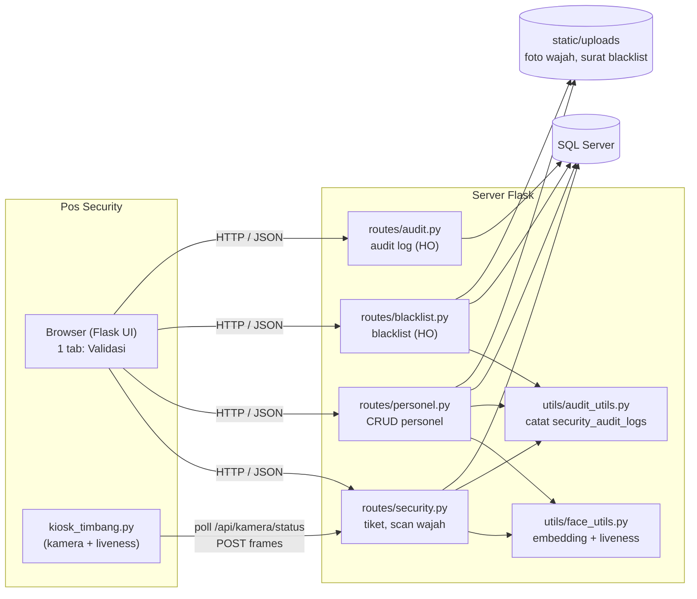
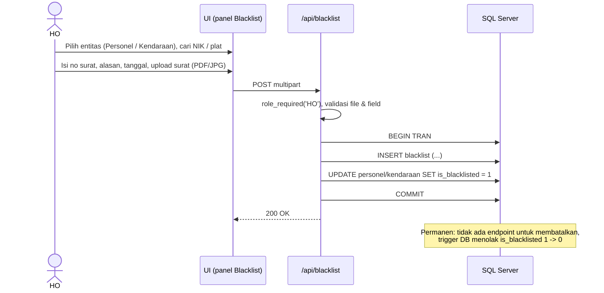
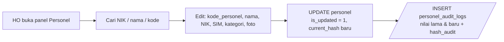
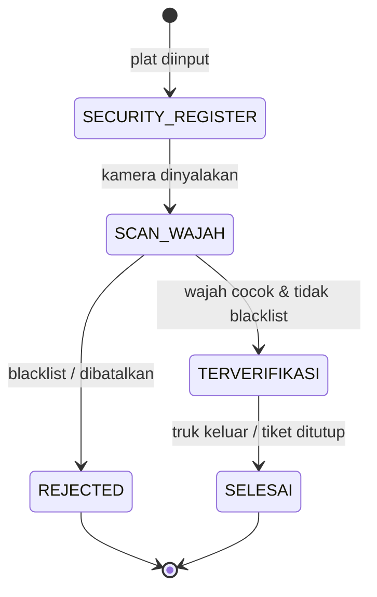
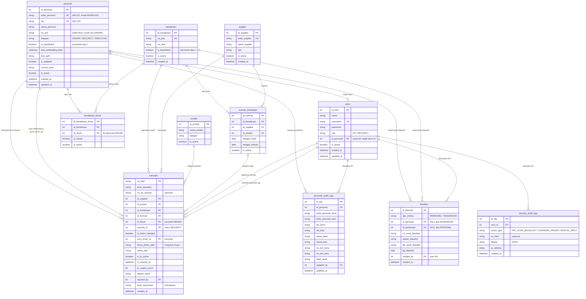

# Perancangan Sistem Face Recognition Personel (clone dari timbangan_sawit_v2)

Dokumen ini adalah rancangan untuk versi **face recognition saja** yang diturunkan dari
`timbangan_sawit_v2`. Isinya: ruang lingkup, perubahan dari v2, arsitektur, workflow,
ERD (Mermaid), rancangan tampilan, daftar API, dan rencana implementasi.

Draf SQL-nya ada di `database/migrations/002_personel_blacklist.sql`.

---

## 1. Ruang lingkup

| | v2 (sekarang) | Clone face recognition |
|---|---|---|
| Subjek wajah | Supir saja (`driver`) | Semua personel (`personel`): **DRIVER**, **SECURITY**, **EMPLOYEE** (orang HO) |
| Tahapan | Security → Timbang 1 → Sortasi/Lab → Timbang 2 | Hanya **Security / Validasi Wajah** |
| Role login | ADMIN, SECURITY, OPERATOR_TIMBANG, SORTASI, LAB | **HO** dan **SECURITY** |
| Blacklist | Tidak ada | Ada, untuk **personel** dan **kendaraan**, ditetapkan HO dengan surat |
| Audit | `driver_audit_logs` | `personel_audit_logs` + `security_audit_logs` (aktivitas security dipantau HO) |
| Master data | plat, supplier, produk, kontrak | **Tetap ada**, karena tiket supir tetap mencatat truk, supplier, dan produk |
| Tampilan | 4 tab (Security, Timbangan, Sortasi, Lab) | **1 tab**, isinya bagian yang bisa dibuka/ditutup (show/hide) |

Yang **dibuang** dari aplikasi: tab & route Timbangan, Sortasi, Lab, pembacaan serial
timbangan (`serial_reader.py`, `timbang_state.py`). Tabel `timbangan`, `sortasi`, `lab_hasil`,
`standar_mutu`, `timeline_monitoring` **tidak dihapus** dari database (data lama aman), hanya
tidak dipakai lagi.

---

## 2. Aktor dan hak akses

| Aktor | Login? | Bisa apa |
|---|---|---|
| **SECURITY** (user) | Ya | Input plat, scan wajah, buat tiket supir, daftar personel baru (kategori DRIVER), ganti supir, cetak QR |
| **HO** (user) | Ya | Semua yang bisa Security, plus: isi/ubah **kode_personel**, ubah kategori, **menetapkan blacklist**, melihat **audit log** security & personel |
| **Personel** | Tidak | Orang yang wajahnya dipindai: supir, petugas security, karyawan HO |

Catatan: satu akun `users` bisa dihubungkan ke satu data `personel` lewat `users.id_personel`
(misalnya petugas security yang login juga terdaftar wajahnya sebagai personel SECURITY).

---

## 3. Arsitektur



---

## 4. Workflow

### 4.1 Validasi supir & buat tiket (alur utama, dipakai SECURITY dan HO)


Aturan penting:

- **Pemeriksaan blacklist dilakukan di server**, bukan hanya di tampilan: `buat-tiket` menolak
  kalau kendaraan atau supir berstatus blacklist, walaupun form dikirim paksa.
- **Input manual** (wajah gagal dikenali tetapi tiket tetap dibuat, bila `WAJIB_SCAN_WAJAH=false`)
  dicatat sebagai `MANUAL_INPUT`.
- `hash_keamanan` = HMAC-SHA256 dari `no_tiket|id_kendaraan|id_driver|id_supplier|id_produk|created_at`
  memakai `HASH_SECRET_KEY`. HO bisa memverifikasi bahwa baris tiket tidak diubah langsung di database.

### 4.2 Blacklist oleh HO



### 4.3 Kelola personel (HO)



- `kode_personel` (misal `PRGBS-001`) hanya bisa diisi/diubah HO. Security boleh mendaftarkan
  personel DRIVER baru, kodenya kosong sampai HO mengisi.
- Setiap perubahan identitas tetap membuat baris audit (seperti `driver_audit_logs` di v2).

### 4.4 Status tiket



Karena clone ini tidak punya tahap timbang/sortasi/lab, status lama (`TIMBANG_1`,
`INSPEKSI_PROSES`, `TIMBANG_2`) dipetakan ke `TERVERIFIKASI` saat migrasi.

---

## 5. ERD

### 5.1 Diagram



### 5.2 Penyesuaian terhadap ERD usulan (gambar kiri)

ERD usulan sudah bagus; ada beberapa penyesuaian supaya cocok dengan kode dan data v2:

1. **`transaksi.security_id` tetap FK ke `users`**, bukan ke `personel`.
   Yang menekan tombol Submit adalah akun yang login; akun itu yang harus bertanggung jawab
   di audit. Supaya tetap bisa ditelusuri "personel security mana", ditambahkan
   `users.id_personel` → `personel`. Jadi: `transaksi.security_id → users.id_personel → personel`.
   Data tiket lama juga tidak rusak karena nilainya memang ID user.
2. **`personel.foto_path` dipertahankan**. Kolom ini sudah ada di v2 dan dipakai untuk
   menampilkan foto di info bar dan kartu supir.
3. **`personel.no_sim` boleh NULL**. Personel SECURITY dan EMPLOYEE tidak selalu punya SIM.
   Aturan "DRIVER wajib punya SIM" dibuat sebagai CHECK constraint.
4. **`kode_personel` UNIQUE tapi boleh kosong** (filtered unique index), karena Security bisa
   mendaftarkan supir baru sebelum HO memberi kode.
5. **`blacklist` diberi CHECK**: kalau `tipe_entitas = 'PERSONEL'` maka `id_personel` wajib
   dan `id_kendaraan` harus NULL, dan sebaliknya.
6. **Blacklist permanen dijaga di database** dengan trigger yang menolak perubahan
   `is_blacklisted` dari 1 ke 0 (tidak hanya mengandalkan aplikasi).
7. **`security_audit_logs.no_tiket`** (opsional) ditambahkan supaya HO bisa langsung menautkan
   log `OVERRIDE_DRIVER` ke tiketnya.
8. **`kendaraan_driver` dan `kontrak_kendaraan` dari migrasi 001 tetap dipakai**
   (saran supir utama dan kontrak truk–supplier). Kolom `id_driver` di tabel ini tidak diganti
   nama supaya perubahan kode tidak terlalu besar; isinya ID personel kategori DRIVER.
9. **`users.role`**: akun aktif hanya boleh HO atau SECURITY. ADMIN lama menjadi HO.
   Akun LAB / SORTASI / OPERATOR_TIMBANG dinonaktifkan (role lamanya tetap tersimpan).

### 5.3 Relasi

| Induk (1) | Anak (N) | Kolom FK | Arti |
|---|---|---|---|
| personel | transaksi | `id_driver` | Supir yang membawa truk pada tiket |
| personel | transaksi | `prev_driver_id` (opsional) | Supir sebelumnya bila terjadi pergantian |
| personel | blacklist | `id_personel` (opsional) | Rekam jejak blacklist personel |
| personel | personel_audit_logs | `id_personel` | Riwayat perubahan identitas |
| personel | users | `users.id_personel` (opsional, 0..1) | Wajah milik akun login |
| kendaraan | transaksi | `id_kendaraan` | Truk yang dipakai |
| kendaraan | blacklist | `id_kendaraan` (opsional) | Rekam jejak blacklist kendaraan |
| supplier | transaksi | `id_supplier` | Supplier/buyer tiket |
| produk | transaksi | `id_produk` | Produk yang dibawa |
| users | transaksi | `security_id`, `rejected_by` | Petugas pembuat / penolak tiket |
| users | blacklist | `created_by` | HO yang menetapkan blacklist |
| users | personel_audit_logs | `updated_by` | User yang mengubah data personel |
| users | security_audit_logs | `user_id` | Aktivitas security yang dipantau HO |

---

## 6. Rancangan tampilan (sesimpel mungkin)

Deretan 4 tab di `base.html` dihapus. Hanya ada **satu halaman** (`partials/validasi_tab.html`,
turunan `security_tab.html`). Pindah tampilan lewat sidebar yang sudah ada (`setSidebarView`),
isi per bagian dibuka/ditutup dengan `toggleSection` yang juga sudah ada.

```
┌ Sidebar ───────┐ ┌ Topbar: Face Recognition            Budi (SECURITY) ⏻ ┐
│ ▸ Validasi     │ ├──────────────────────────────────────────────────────────┤
│ ▸ Daftar Tiket │ │ Info bar: No Tiket | No Plat | Supplier | Supir | [foto] │
│ ── HO saja ──  │ ├──────────────────────────────────────────────────────────┤
│ ▸ Personel     │ │ ▼ 1. Kendaraan        (plat, STNK, supplier, produk, DO) │
│ ▸ Blacklist    │ │ ▼ 2. Scan Wajah       (kamera, hasil, identitas)         │
│ ▸ Audit Log    │ │ ▶ 3. Ganti / Tambah Supir   (tertutup, dibuka jika perlu) │
└────────────────┘ │ [!] Banner merah BLACKLIST muncul di atas jika terkena   │
                   │                                  [Submit] [Cetak QR]     │
                   └──────────────────────────────────────────────────────────┘
```

| View (sidebar) | Siapa | Isi |
|---|---|---|
| **Validasi** | SECURITY, HO | Form tiket 3 bagian di atas. Bagian 2 terkunci sampai plat valid & tidak blacklist |
| **Daftar Tiket** | SECURITY, HO | Tiket aktif + riwayat supir (isi view "List" yang sekarang) |
| **Personel** | HO | Tabel personel, filter kategori, edit kode/identitas/foto, badge blacklist |
| **Blacklist** | HO | Form penetapan (entitas, no surat, alasan, tanggal, upload surat) + tabel riwayat |
| **Audit Log** | HO | Tab kecil: Security (`security_audit_logs`) dan Personel (`personel_audit_logs`) |

Menu khusus HO disembunyikan dengan Jinja (``) **dan**
endpoint-nya dijaga `@role_required('HO')`, jadi bukan hanya tersembunyi di tampilan.

Modal yang tetap: Tambah Personel (dulu Tambah Supir), Update (Ganti Supir, Edit Data,
Supir Truk, Kontrak Truk), Cetak QR.

---

## 7. Daftar API

| Metode | Endpoint | Role | Keterangan |
|---|---|---|---|
| POST | `/api/plat/lookup` | semua | + `kendaraan_blacklist` di respons |
| POST | `/api/security/buat-tiket` | SECURITY, HO | + cek blacklist server-side, `is_driver_changed`, `prev_driver_id`, snapshot foto, `hash_keamanan` |
| GET | `/api/security/list-tiket-aktif` | semua | tetap |
| POST | `/api/security/tutup-tiket` | SECURITY, HO | **baru**: status `SELESAI` |
| POST | `/api/personel/cari-by-nik` | semua | dulu `/api/driver/cari-by-nik` |
| POST | `/api/personel/tambah` | SECURITY (DRIVER saja), HO (semua kategori) | dulu `/api/driver/tambah`; tolak wajah/NIK yang mirip personel blacklist |
| POST | `/api/personel/update-identitas` | SECURITY, HO | kode_personel & kategori hanya HO |
| GET | `/api/personel` | HO | **baru**: daftar + filter |
| POST | `/api/verifikasi-wajah` | kiosk | respons + `kategori`, `is_blacklisted` |
| GET | `/api/blacklist` | HO | **baru** |
| POST | `/api/blacklist/tambah` | HO | **baru**, multipart (file surat) |
| GET | `/api/audit/security` | HO | **baru** |
| GET | `/api/audit/personel` | HO | **baru** |
| — | `/api/timbang/*`, `/api/sortasi/*`, `/api/lab/*` | — | **dihapus** |

---

## 8. Rencana implementasi (bertahap)

1. **Database**: jalankan `002_personel_blacklist.sql` pada **salinan** database (misal `DbFaceRecognition`),
   lalu arahkan `DB_NAME` di `.env` ke database itu.
2. **Bersih-bersih**: hapus `routes/timbangan.py`, `sortasi.py`, `lab.py`, partial & JS-nya,
   `utils/serial_reader.py`, `utils/timbang_state.py`; hapus deretan tab di `base.html`.
3. **Rename driver → personel** di `utils/db_utils.py`, `routes/security.py`, `serializers.py`,
   `verifikasi_state.py`, `static/js/security.js`, `supir.js`, `kendaraan.js`.
4. **Blacklist**: `routes/blacklist.py`, cek di `plat/lookup`, `verifikasi-wajah`, `buat-tiket`, `personel/tambah`.
5. **Audit**: `utils/audit_utils.py` (`catat_aktivitas(user_id, action_type, details, no_tiket=None)`),
   panggil di titik TRY_SCAN_BLACKLIST / OVERRIDE_DRIVER / MANUAL_INPUT.
6. **Tampilan**: sidebar baru + panel HO (Personel, Blacklist, Audit Log).
7. **Tes**: tambah unit test untuk aturan blacklist & hash tiket (`tests/`).

---

## 9. Yang perlu dikonfirmasi

1. **Wajah personel SECURITY / EMPLOYEE dipakai untuk apa?** Saat ini dirancang hanya untuk
   identifikasi (tampil identitas, dan menautkan akun login ke wajahnya). Kalau maksudnya
   absensi atau akses masuk karyawan HO, perlu satu tabel log kunjungan tambahan.
2. **Blacklist benar-benar permanen?** Dirancang tidak bisa dicabut sama sekali. Kalau suatu saat
   HO perlu mencabut (misalnya salah input), perlu kolom `is_revoked`, `revoked_by`, dan `revoked_at`.
3. **Kapan tiket `SELESAI`?** Tanpa tahap timbang, diusulkan Security menutup tiket saat truk keluar
   (tombol "Tutup Tiket"), atau otomatis saat `qr_expired_at` lewat.
