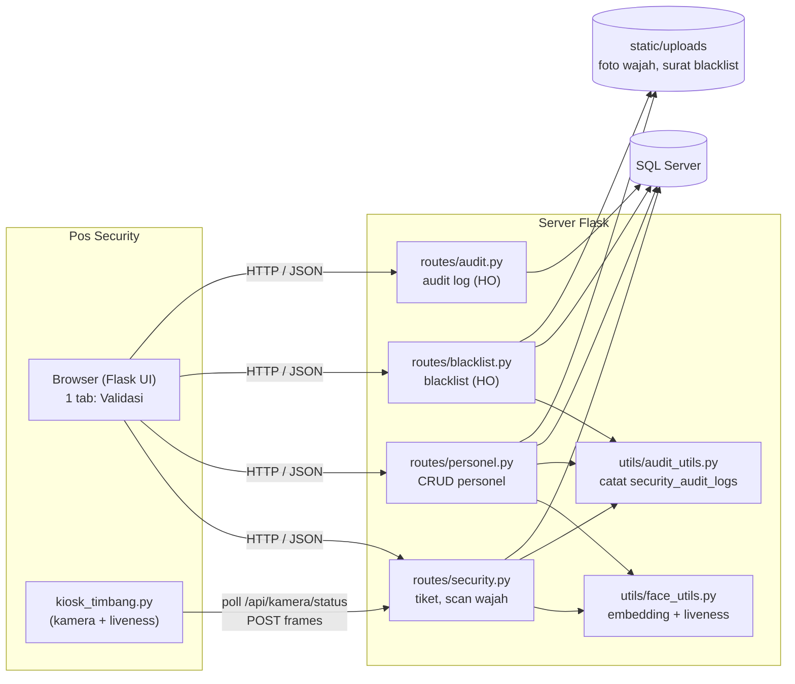
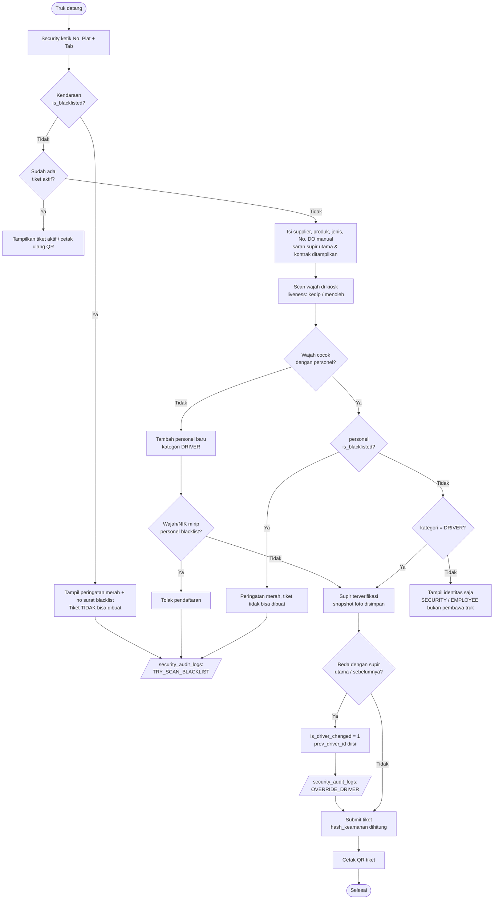
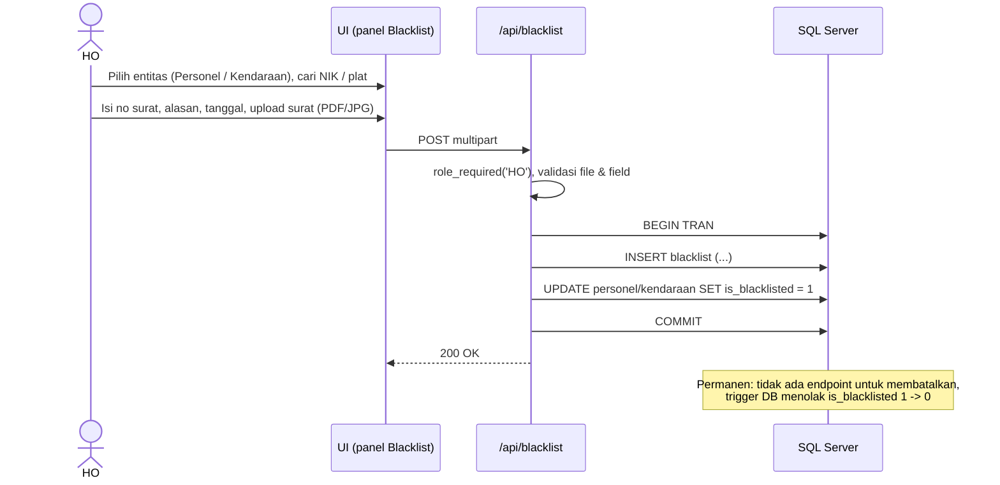
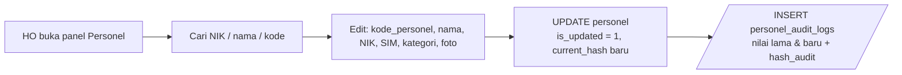
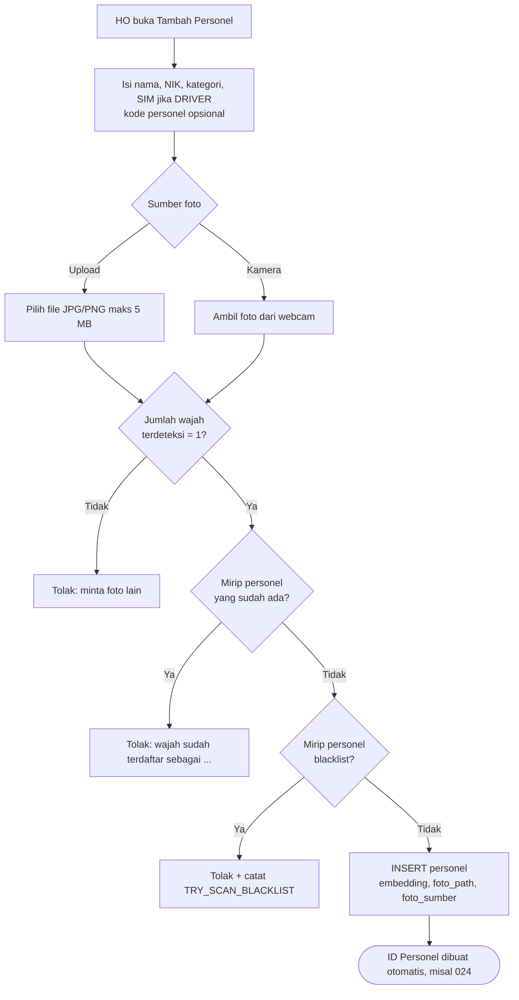
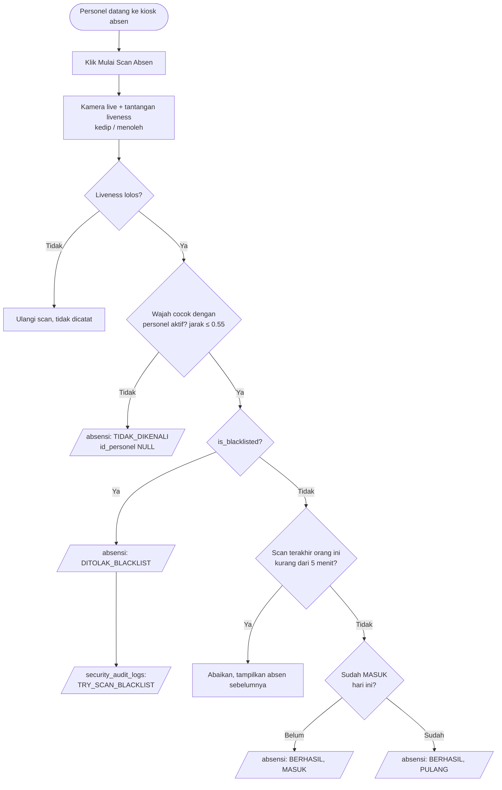
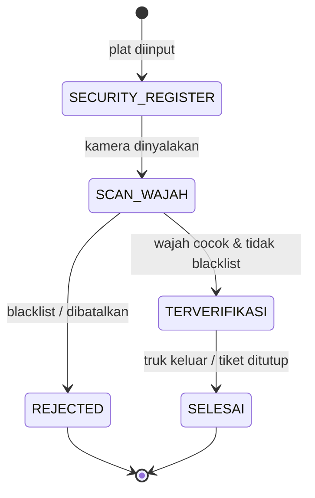

# Perancangan Sistem Face Recognition Personel (clone dari timbangan_sawit_v2)

Dokumen ini adalah rancangan untuk versi **face recognition saja** yang diturunkan dari
`timbangan_sawit_v2`. Isinya: ruang lingkup, perubahan dari v2, arsitektur, workflow,
ERD (Mermaid), rancangan tampilan, daftar API, dan rencana implementasi.

Draf SQL-nya ada di `database/migrations/002_personel_blacklist.sql`.

---

## 1. Ruang lingkup

| | v2 (sekarang) | Clone face recognition |
|---|---|---|
| Subjek wajah | Supir saja (`driver`) | Semua personel (`personel`): **DRIVER**, **SECURITY**, **EMPLOYEE** (orang HO) |
| Tahapan | Security → Timbang 1 → Sortasi/Lab → Timbang 2 | Hanya **Security / Validasi Wajah** |
| Role login | ADMIN, SECURITY, OPERATOR_TIMBANG, SORTASI, LAB | Dipakai **HO** dulu, semua menu tampil. Role **HO** / **SECURITY** disiapkan untuk pembatasan nanti |
| Pendaftaran wajah | Rekam live di pos | **Upload foto** (atau kamera). Tidak wajib live |
| Absensi | Tidak ada | **Absen masuk/pulang pakai face recognition live** + liveness |
| Blacklist | Tidak ada | Ada, untuk **personel** dan **kendaraan**, ditetapkan HO dengan surat |
| Audit | `driver_audit_logs` | `personel_audit_logs` + `security_audit_logs` (aktivitas security dipantau HO) |
| Master data | plat, supplier, produk, kontrak | **Tetap ada**, karena tiket supir tetap mencatat truk, supplier, dan produk |
| Tampilan | 4 tab (Security, Timbangan, Sortasi, Lab) | **1 tab**, isinya bagian yang bisa dibuka/ditutup (show/hide) |

Yang **dibuang** dari aplikasi: tab & route Timbangan, Sortasi, Lab, pembacaan serial
timbangan (`serial_reader.py`, `timbang_state.py`). Tabel `timbangan`, `sortasi`, `lab_hasil`,
`standar_mutu`, `timeline_monitoring` **tidak dihapus** dari database (data lama aman), hanya
tidak dipakai lagi.

---

## 2. Aktor dan hak akses

**Tahap sekarang: aplikasi dipakai HO dan semua menu/data ditampilkan tanpa pembatasan role.**
Kolom `users.role` tetap ada supaya pembatasan per role bisa ditambahkan di pengembangan
berikutnya tanpa mengubah database. Rencana pembagiannya nanti:

| Aktor | Login? | Rencana hak akses (tahap berikutnya) |
|---|---|---|
| **HO** (user) | Ya | Semua menu (sekarang semua user memakai tampilan ini) |
| **SECURITY** (user) | Ya | Validasi Wajah dan Daftar Tiket saja |
| **Personel** | Tidak | Orang yang wajahnya terdaftar: supir (DRIVER), petugas security (SECURITY), karyawan HO baru (EMPLOYEE) |

Catatan: satu akun `users` bisa dihubungkan ke satu data `personel` lewat `users.id_personel`
(misalnya petugas security yang login juga terdaftar wajahnya sebagai personel SECURITY).

### 2.1 Dua identitas personel: ID dan Kode

| | `id_personel` | `kode_personel` |
|---|---|---|
| Contoh | `006` | `PRGBS-001` |
| Dibuat oleh | Database (IDENTITY, otomatis) | HO, diisi/diubah lewat menu Personel |
| Bisa berubah? | **Tidak pernah** | Ya, setiap perubahan tercatat di `personel_audit_logs` |
| Wajib? | Ya | Boleh kosong dulu (misal personel baru didaftarkan dari pos), unik bila diisi |
| Dipakai untuk | **Semua relasi**: tiket, blacklist, audit, supir truk, akun login | Tampilan dan pencarian |

Karena semua FK memakai `id_personel`, HO bisa mengganti kode (misal dari `PRGBS-010` menjadi
`PRGBS-001`) tanpa memutus riwayat tiket atau blacklist. Kode **jangan** dipakai sebagai FK.
Format tampilan di seluruh UI: `Kode · Nama`, atau `ID 014 · Nama` bila kode masih kosong.

---

## 3. Arsitektur



---

## 4. Workflow

### 4.1 Validasi supir & buat tiket (alur utama, dipakai SECURITY dan HO)



Aturan penting:

- **Pemeriksaan blacklist dilakukan di server**, bukan hanya di tampilan: `buat-tiket` menolak
  kalau kendaraan atau supir berstatus blacklist, walaupun form dikirim paksa.
- **Input manual** (wajah gagal dikenali tetapi tiket tetap dibuat, bila `WAJIB_SCAN_WAJAH=false`)
  dicatat sebagai `MANUAL_INPUT`.
- `hash_keamanan` = HMAC-SHA256 dari `no_tiket|id_kendaraan|id_driver|id_supplier|id_produk|created_at`
  memakai `HASH_SECRET_KEY`. HO bisa memverifikasi bahwa baris tiket tidak diubah langsung di database.

### 4.2 Blacklist oleh HO



### 4.3 Kelola personel (HO)



- `kode_personel` (misal `PRGBS-001`) hanya bisa diisi/diubah HO. Security boleh mendaftarkan
  personel DRIVER baru, kodenya kosong sampai HO mengisi.
- Setiap perubahan identitas tetap membuat baris audit (seperti `driver_audit_logs` di v2).

### 4.4 Pendaftaran personel (upload foto)



- Foto upload **hanya untuk pendaftaran** (membuat embedding). Pendaftaran tidak butuh liveness.
- Foto harus berisi **tepat satu wajah**. `extract_embedding` di v2 mengambil wajah pertama saja,
  jadi perlu diubah agar menolak foto berisi 0 atau lebih dari 1 wajah.
- `foto_sumber` (UPLOAD / KAMERA) disimpan supaya HO tahu asal foto acuan.

### 4.5 Absensi dengan face recognition



- **Absensi selalu live + liveness**, jadi foto cetak/layar HP tidak bisa dipakai untuk absen.
  Inilah alasan pendaftaran boleh dari upload, tetapi absen tidak.
- Berlaku untuk semua kategori (EMPLOYEE HO, SECURITY, DRIVER). Filter per kategori ada di tampilan.
- Snapshot wajah saat absen disimpan di `absensi.foto_path` sebagai bukti.
- Scan PULANG yang berulang di hari yang sama tidak menimpa data lama. Setiap scan jadi baris baru,
  dan rekap memakai MASUK pertama dan PULANG terakhir per hari.

### 4.6 Status tiket



Karena clone ini tidak punya tahap timbang/sortasi/lab, status lama (`TIMBANG_1`,
`INSPEKSI_PROSES`, `TIMBANG_2`) dipetakan ke `TERVERIFIKASI` saat migrasi.

---

## 5. ERD

### 5.1 Diagram

```mermaid
erDiagram
    users {
        int id_user PK
        string nama
        string username UK
        string password
        string role "HO / SECURITY"
        int id_personel FK "opsional, wajah akun ini"
        boolean is_active
        datetime created_at
        datetime updated_at
    }
    personel {
        int id_personel PK
        string kode_personel UK "diisi HO, misal PRGBS-001"
        string nik UK "NIK KTP"
        string nama_personel
        string no_sim "boleh NULL untuk non-DRIVER"
        string kategori "DRIVER / SECURITY / EMPLOYEE"
        boolean is_blacklisted "permanen jika 1"
        varbinary face_embedding_data
        string foto_path
        string foto_sumber "UPLOAD / KAMERA"
        boolean is_updated
        string current_hash
        boolean is_active
        datetime created_at
        datetime updated_at
    }
    kendaraan {
        int id_kendaraan PK
        string no_plat UK
        string no_stnk
        boolean is_blacklisted "permanen jika 1"
        boolean is_active
        datetime created_at
    }
    supplier {
        int id_supplier PK
        string kode_supplier UK
        string nama_supplier
        string tipe
        boolean is_active
        datetime created_at
    }
    produk {
        int id_produk PK
        string nama_produk
        string kategori
        boolean is_active
    }
    kendaraan_driver {
        int id_kendaraan_driver PK
        int id_kendaraan FK
        int id_driver FK "ke personel DRIVER"
        boolean is_utama
        boolean is_active
    }
    kontrak_kendaraan {
        int id_kontrak PK
        int id_kendaraan FK
        int id_supplier FK
        int id_produk FK
        date tanggal_mulai
        date tanggal_selesai
        boolean is_active
    }
    transaksi {
        string no_tiket PK
        string jenis_transaksi
        string no_do_manual "opsional"
        int id_supplier FK
        int id_produk FK
        int id_kendaraan FK
        int id_kontrak FK
        int id_driver FK "personel DRIVER"
        int security_id FK "users SECURITY"
        boolean is_driver_changed
        int prev_driver_id FK "personel"
        string driver_photo_path "snapshot di pos"
        string status_alur
        boolean is_qr_active
        datetime qr_expired_at
        int qr_reprint_count
        string alasan_reject
        int rejected_by FK
        string hash_keamanan "anti-tamper"
        datetime created_at
    }
    blacklist {
        int id_blacklist PK
        string tipe_entitas "PERSONEL / KENDARAAN"
        int id_personel FK "NULL jika KENDARAAN"
        int id_kendaraan FK "NULL jika PERSONEL"
        string no_surat_blacklist
        string alasan_blacklist
        string file_surat_blacklist
        date tgl_blacklist
        int created_by FK "user HO"
        datetime created_at
    }
    personel_audit_logs {
        int id_log PK
        int id_personel FK
        string kode_personel_lama
        string kode_personel_baru
        string nik_lama
        string nik_baru
        string nama_lama
        string nama_baru
        string no_sim_lama
        string no_sim_baru
        string hash_audit
        int updated_by FK
        datetime updated_at
    }
    absensi {
        int id_absensi PK
        int id_personel FK "NULL jika tidak dikenali"
        string jenis "MASUK / PULANG"
        string status "BERHASIL / TIDAK_DIKENALI / DITOLAK_BLACKLIST"
        float jarak_wajah
        string tantangan_liveness
        string foto_path "snapshot saat absen"
        string perangkat
        string ip_address
        datetime waktu
        date tanggal "computed dari waktu"
    }
    security_audit_logs {
        int id_log PK
        int user_id FK
        string action_type "TRY_SCAN_BLACKLIST / OVERRIDE_DRIVER / MANUAL_INPUT"
        string no_tiket "opsional"
        string details "JSON"
        string ip_address
        datetime created_at
    }

    personel ||--o{ transaksi : "mengemudi (id_driver)"
    personel ||--o{ transaksi : "supir sebelumnya (prev_driver_id)"
    personel ||--o{ personel_audit_logs : "riwayat perubahan"
    personel |o--o{ absensi : "absen masuk / pulang"
    personel ||--o{ blacklist : "rekam jejak blacklist"
    personel |o--o| users : "wajah akun"
    personel ||--o{ kendaraan_driver : "supir truk"
    kendaraan ||--o{ kendaraan_driver : "punya supir"
    kendaraan ||--o{ kontrak_kendaraan : "dikontrak"
    kendaraan ||--o{ transaksi : "digunakan pada"
    kendaraan ||--o{ blacklist : "rekam jejak blacklist"
    supplier ||--o{ transaksi : "menyuplai"
    supplier ||--o{ kontrak_kendaraan : "kontrak"
    produk ||--o{ transaksi : "kategori barang"
    kontrak_kendaraan |o--o{ transaksi : "berlaku pada"
    users ||--o{ transaksi : "diperiksa security"
    users ||--o{ transaksi : "menolak (rejected_by)"
    users ||--o{ blacklist : "dieksekusi HO"
    users ||--o{ personel_audit_logs : "diupdate HO"
    users ||--o{ security_audit_logs : "dipantau HO"
```



### 5.2 Penyesuaian terhadap ERD usulan (gambar kiri)

ERD usulan sudah bagus; ada beberapa penyesuaian supaya cocok dengan kode dan data v2:

1. **`transaksi.security_id` tetap FK ke `users`**, bukan ke `personel`.
   Yang menekan tombol Submit adalah akun yang login; akun itu yang harus bertanggung jawab
   di audit. Supaya tetap bisa ditelusuri "personel security mana", ditambahkan
   `users.id_personel` → `personel`. Jadi: `transaksi.security_id → users.id_personel → personel`.
   Data tiket lama juga tidak rusak karena nilainya memang ID user.
2. **`personel.foto_path` dipertahankan**. Kolom ini sudah ada di v2 dan dipakai untuk
   menampilkan foto di info bar dan kartu supir.
3. **`personel.no_sim` boleh NULL**. Personel SECURITY dan EMPLOYEE tidak selalu punya SIM.
   Aturan "DRIVER wajib punya SIM" dibuat sebagai CHECK constraint.
4. **`kode_personel` UNIQUE tapi boleh kosong** (filtered unique index), karena Security bisa
   mendaftarkan supir baru sebelum HO memberi kode.
5. **`blacklist` diberi CHECK**: kalau `tipe_entitas = 'PERSONEL'` maka `id_personel` wajib
   dan `id_kendaraan` harus NULL, dan sebaliknya.
6. **Blacklist permanen dijaga di database** dengan trigger yang menolak perubahan
   `is_blacklisted` dari 1 ke 0 (tidak hanya mengandalkan aplikasi).
7. **`security_audit_logs.no_tiket`** (opsional) ditambahkan supaya HO bisa langsung menautkan
   log `OVERRIDE_DRIVER` ke tiketnya.
8. **`kendaraan_driver` dan `kontrak_kendaraan` dari migrasi 001 tetap dipakai**
   (saran supir utama dan kontrak truk–supplier). Kolom `id_driver` di tabel ini tidak diganti
   nama supaya perubahan kode tidak terlalu besar; isinya ID personel kategori DRIVER.
9. **`users.role`** (disiapkan untuk pembatasan nanti): akun aktif hanya boleh HO atau SECURITY. ADMIN lama menjadi HO.
   Akun LAB / SORTASI / OPERATOR_TIMBANG dinonaktifkan (role lamanya tetap tersimpan).

### 5.3 Relasi

| Induk (1) | Anak (N) | Kolom FK | Arti |
|---|---|---|---|
| personel | transaksi | `id_driver` | Supir yang membawa truk pada tiket |
| personel | transaksi | `prev_driver_id` (opsional) | Supir sebelumnya bila terjadi pergantian |
| personel | blacklist | `id_personel` (opsional) | Rekam jejak blacklist personel |
| personel | personel_audit_logs | `id_personel` | Riwayat perubahan identitas |
| personel | users | `users.id_personel` (opsional, 0..1) | Wajah milik akun login |
| personel | absensi | `absensi.id_personel` (opsional) | Riwayat absen; NULL bila wajah tidak dikenali |
| kendaraan | transaksi | `id_kendaraan` | Truk yang dipakai |
| kendaraan | blacklist | `id_kendaraan` (opsional) | Rekam jejak blacklist kendaraan |
| supplier | transaksi | `id_supplier` | Supplier/buyer tiket |
| produk | transaksi | `id_produk` | Produk yang dibawa |
| users | transaksi | `security_id`, `rejected_by` | Petugas pembuat / penolak tiket |
| users | blacklist | `created_by` | HO yang menetapkan blacklist |
| users | personel_audit_logs | `updated_by` | User yang mengubah data personel |
| users | security_audit_logs | `user_id` | Aktivitas security yang dipantau HO |

---

## 6. Rancangan tampilan (sesimpel mungkin)

Desain Figma: <https://www.figma.com/design/MYtNtlrszccggmaS5iUIus> (halaman
"UI · Face Recognition (show/hide)", 9 layar + kartu catatan ID vs Kode).

Prinsipnya sama dengan v2: sidebar gelap, topbar hitam, kotak abu-abu yang bisa dibuka/ditutup
(`toggleSection`). Deretan 4 tab di `base.html` diganti **satu tab saja** yang judulnya mengikuti
menu aktif. Pindah halaman lewat sidebar (`setSidebarView`). Untuk sekarang **semua menu tampil**.

```
┌ Sidebar ────────┐ ┌ Topbar: Face Recognition               Andi (HO) ⏻ ┐
│ OPERASIONAL     │ ├──────────────────────────────────────────────────────┤
│ ▸ Validasi Wajah│ │ Info bar: No Tiket | Plat | DO | Supplier | Supir | [foto] │
│ ▸ Daftar Tiket  │
│ ▸ Absensi       │ ├ [ Validasi Wajah ] ──────────────────────────────────┤
│ DATA            │ │ [!] Banner merah BLACKLIST (hanya jika terkena)       │
│ ▸ Personel      │ │ ▼ 1. Informasi Kendaraan (plat, STNK, DO, supplier…)  │
│ ▸ Master Data   │ │ ▼ 2. Scan Wajah & Identitas Personel (ID + Kode)      │
│ ▸ Blacklist     │ │ ▶ 3. Ganti Supir / Supir & Kontrak Truk (tertutup)    │
│ ▸ Audit Log     │ │                          [Tambah] [Update] [Submit]  │
└─────────────────┘ └──────────────────────────────────────────────────────┘
```

| Layar Figma | Isi (setiap baris = section show/hide) |
|---|---|
| 01 Validasi Wajah | 1. Informasi Kendaraan · 2. Scan Wajah & Identitas Personel (ID terkunci, Kode, kategori, status blacklist) · 3. Ganti Supir / Supir & Kontrak Truk |
| 02 Validasi — Blacklist | Banner merah + no. surat, plat bertanda merah, bagian 2 terkunci, Submit nonaktif |
| 08 Absensi | Scan Absensi (kamera live + tantangan liveness, kartu hasil) · Absensi Hari Ini (filter kategori / ditolak) · Rekap Bulanan (tertutup) |
| 09 Modal Tambah Personel | Data personel + pilihan sumber foto **Upload Foto** / Kamera, preview, hasil cek wajah |
| 03 Daftar Tiket | List Tiket Aktif · Riwayat Personel · Tiket Selesai/Ditolak (tertutup) |
| 04 Personel | Filter kategori (Driver / Security / Employee HO / Blacklist) · Daftar Personel (kolom ID dan Kode terpisah) · Edit Personel (ID terkunci, Kode bisa diubah, ganti foto via Upload / Kamera) |
| 05 Master Data | Kendaraan · Supplier/Buyer · Produk · Kontrak Truk · Supir per Truk |
| 06 Blacklist | Tetapkan Blacklist (Personel/Kendaraan, no. surat, tanggal, alasan, upload surat, peringatan permanen) · Riwayat Blacklist |
| 07 Audit Log | Aktivitas Security · Perubahan Data Personel (termasuk kode lama → baru) |

Modal yang tetap: Tambah Personel (dulu Tambah Supir, sekarang ada pilihan kategori),
Update (Ganti Supir, Edit Data, Supir Truk, Kontrak Truk), Cetak QR.

**Tahap berikutnya (role):** menu di bawah grup DATA disembunyikan untuk SECURITY dengan Jinja
(``) **dan** endpoint-nya dijaga `@role_required('HO')`.

---

## 7. Daftar API

| Metode | Endpoint | Role (tahap berikutnya) | Keterangan |
|---|---|---|---|
| POST | `/api/plat/lookup` | semua | + `kendaraan_blacklist` di respons |
| POST | `/api/security/buat-tiket` | SECURITY, HO | + cek blacklist server-side, `is_driver_changed`, `prev_driver_id`, snapshot foto, `hash_keamanan` |
| GET | `/api/security/list-tiket-aktif` | semua | tetap |
| POST | `/api/security/tutup-tiket` | SECURITY, HO | **baru**: status `SELESAI` |
| POST | `/api/personel/cari-by-nik` | semua | dulu `/api/driver/cari-by-nik` |
| POST | `/api/personel/tambah` | SECURITY (DRIVER saja), HO (semua kategori) | dulu `/api/driver/tambah`; multipart `foto` dari **upload file atau kamera** + `foto_sumber`; tolak 0 / >1 wajah, wajah yang sudah terdaftar, dan yang mirip personel blacklist |
| POST | `/api/personel/update-identitas` | SECURITY, HO | kode_personel & kategori hanya HO |
| GET | `/api/personel` | HO | **baru**: daftar + filter |
| POST | `/api/absensi/scan` | semua | **baru**: frames + tantangan liveness → cocokkan wajah, tentukan MASUK/PULANG, simpan snapshot |
| GET | `/api/absensi?tanggal=&kategori=` | HO | **baru**: daftar absensi & rekap |
| POST | `/api/verifikasi-wajah` | kiosk | respons + `kategori`, `is_blacklisted` |
| GET | `/api/blacklist` | HO | **baru** |
| POST | `/api/blacklist/tambah` | HO | **baru**, multipart (file surat) |
| GET | `/api/audit/security` | HO | **baru** |
| GET | `/api/audit/personel` | HO | **baru** |
| GET | `/api/master/kendaraan`, `/api/master/supplier`, `/api/master/produk` | HO | **baru**: menu Master Data |

Sekarang semua endpoint cukup `@login_required`; kolom Role adalah rencana pembatasan nanti.
| — | `/api/timbang/*`, `/api/sortasi/*`, `/api/lab/*` | — | **dihapus** |

---

## 8. Rencana implementasi (bertahap)

1. **Database**: jalankan `002_personel_blacklist.sql` pada **salinan** database (misal `DbFaceRecognition`),
   lalu arahkan `DB_NAME` di `.env` ke database itu.
2. **Bersih-bersih**: hapus `routes/timbangan.py`, `sortasi.py`, `lab.py`, partial & JS-nya,
   `utils/serial_reader.py`, `utils/timbang_state.py`; hapus deretan tab di `base.html`.
3. **Rename driver → personel** di `utils/db_utils.py`, `routes/security.py`, `serializers.py`,
   `verifikasi_state.py`, `static/js/security.js`, `supir.js`, `kendaraan.js`.
4. **Blacklist**: `routes/blacklist.py`, cek di `plat/lookup`, `verifikasi-wajah`, `buat-tiket`, `personel/tambah`.
5. **Audit**: `utils/audit_utils.py` (`catat_aktivitas(user_id, action_type, details, no_tiket=None)`),
   panggil di titik TRY_SCAN_BLACKLIST / OVERRIDE_DRIVER / MANUAL_INPUT.
6. **Tampilan**: ikuti desain Figma: sidebar baru, satu tab, panel Personel, Master Data, Blacklist, Audit Log.
7. **Absensi**: `routes/absensi.py` + layar Absensi; `face_utils.extract_embedding` diubah agar wajib tepat 1 wajah;
   kiosk (`kiosk_timbang.py`) bisa dipakai ulang dengan mode absen.
8. **Tes**: tambah unit test untuk aturan blacklist & hash tiket (`tests/`).

---

## 9. Keputusan & yang masih perlu dikonfirmasi

Sudah diputuskan:

- Aplikasi dipakai HO dulu dan menampilkan semua data. Pembatasan role menyusul.
- Personel mencakup orang HO baru (kategori EMPLOYEE), bukan hanya supir.
- Dua identitas: `id_personel` tetap (misal 006), `kode_personel` bisa diubah HO (misal PRGBS-001).
- Pendaftaran personel boleh **upload foto** (tidak wajib live). Face recognition live dipakai untuk **absensi**.

Masih perlu dikonfirmasi:

1. **Blacklist benar-benar permanen?** Dirancang tidak bisa dicabut sama sekali. Kalau suatu saat
   HO perlu mencabut (misalnya salah input), perlu kolom `is_revoked`, `revoked_by`, dan `revoked_at`.
2. **Kapan tiket `SELESAI`?** Tanpa tahap timbang, diusulkan tombol "Tutup Tiket" saat truk keluar,
   atau otomatis saat `qr_expired_at` lewat.
3. **Jam kerja untuk status "Tepat waktu / Terlambat"** di absensi: jam berapa, dan sama untuk semua
   kategori atau beda (misalnya security per shift)?
4. **Format kode personel** selalu `PRGBS-###`? Kalau ya, bisa diberi CHECK di database dan
   saran nomor berikutnya otomatis di form.
