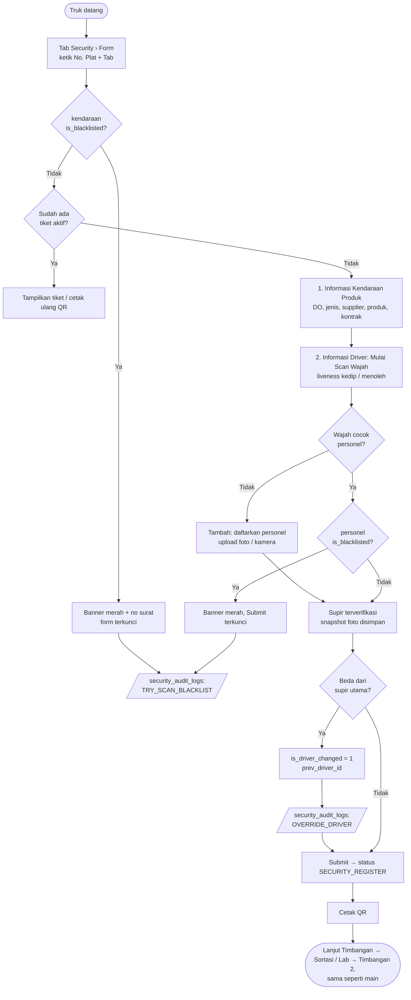
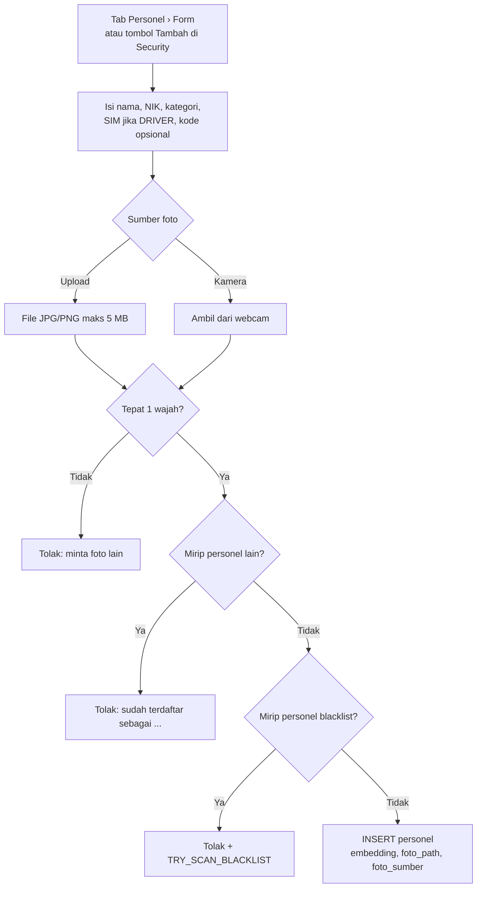
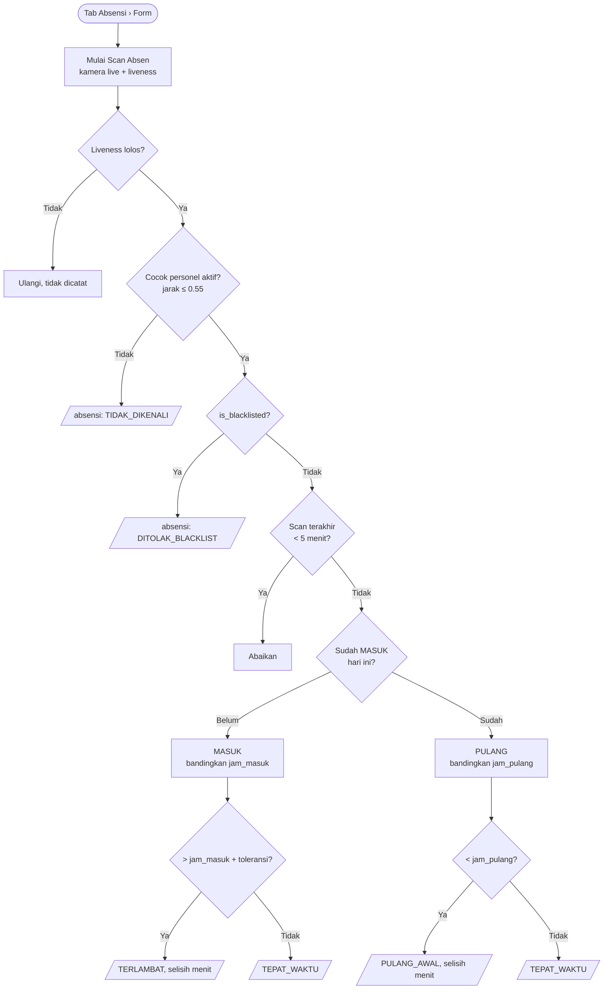
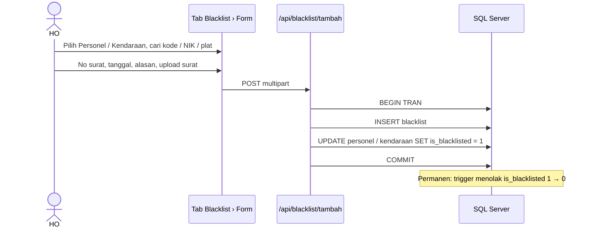
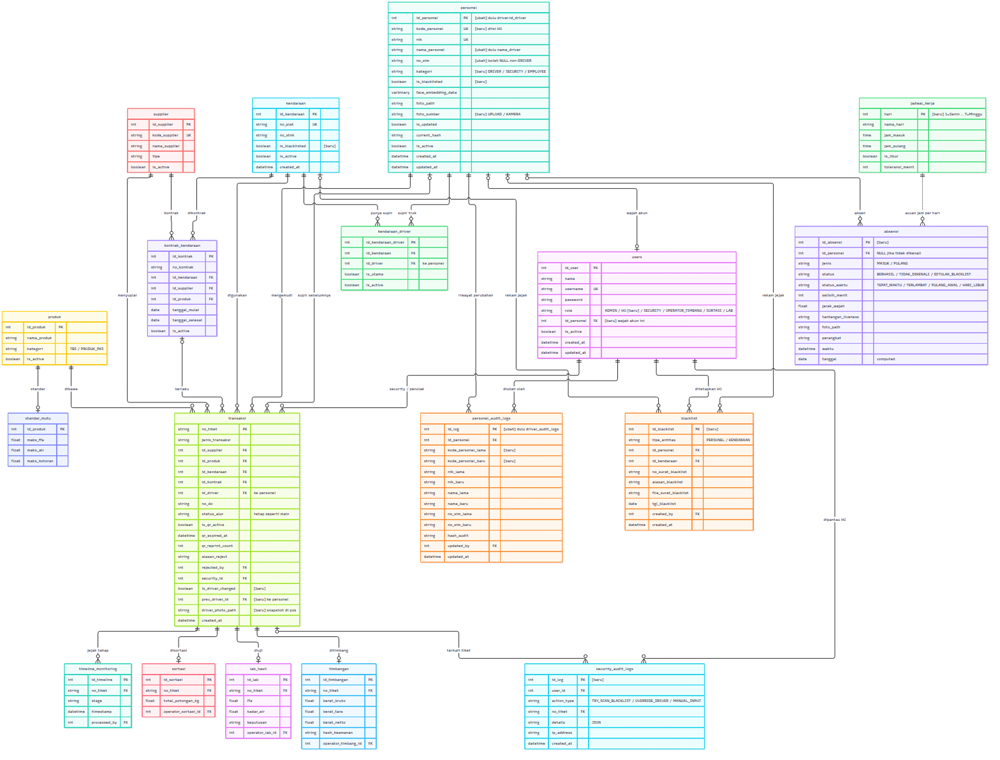

# Perancangan Face Recognition, Blacklist & Absensi di Weighbridge (main)

Fitur face recognition **digabung ke aplikasi Weighbridge (main)**. Komposisi dan desain main
menjadi acuan: fitur baru menyesuaikan diri ke main, bukan sebaliknya.

- Desain Figma: <https://www.figma.com/design/wrygHwLrs9aZjCDDCul5CJ>, file & halaman
  **"Weighbridge + Face Recognition"** (10 layar, sidebar menu per fitur; lihat bagian 9).
  File lama (`MYtNtlrszccggmaS5iUIus`) tidak dipakai lagi.
- Draf SQL: `database/migrations/002_personel_blacklist.sql` (hanya menambah ke skema main).

---

## 1. Prinsip penggabungan

| Bagian main | Perlakuan |
|---|---|
| Sidebar **List / Form**, topbar **Weighbridge**, **info bar** (No Tiket, Plat, DO, Supplier, Supir, foto) | **Tetap** |
| Tab **Security, Timbangan, Sortasi, Laboratorium** (untuk site) | **Tetap**, isi dan alurnya sama |
| Section abu-abu yang bisa dibuka/ditutup (`toggleSection`), kartu putih, tombol biru/hijau/abu | **Tetap**, dipakai juga oleh fitur baru |
| Alur tiket `SECURITY_REGISTER → … → SELESAI`, tabel timbangan/sortasi/lab | **Tetap**, tidak diubah |
| Role ADMIN, SECURITY, OPERATOR_TIMBANG, SORTASI, LAB | **Tetap**, ditambah **HO** |

Yang **ditambahkan**:

1. **Tab baru** di kanan, dipisah garis: **Absensi**, **Personel**, **Blacklist**. Pola sama dengan
   tab lain: sidebar *List* = tabel/rekap, sidebar *Form* = input.
2. **Tab Security** (bagian "2. Informasi Driver"): tampil **ID Personel + Kode Personel**, status
   blacklist, dan banner merah bila kendaraan/supir diblacklist.
3. **Modal Tambah Supir** menjadi Tambah Personel dengan pilihan **Upload Foto** atau Kamera.

Untuk sekarang semua tab tampil (dipakai HO). Pembatasan per role menyusul.

---

## 2. Dua identitas personel: ID dan Kode

| | `id_personel` | `kode_personel` |
|---|---|---|
| Contoh | `006` | `PRGBS-001` |
| Dibuat oleh | Database (IDENTITY, otomatis) | HO, lewat tab Personel |
| Bisa berubah? | **Tidak pernah** | Ya, tercatat di `personel_audit_logs` |
| Wajib? | Ya | Boleh kosong dulu, unik bila diisi |
| Dipakai untuk | **Semua relasi** (tiket, blacklist, absensi, audit, supir truk, akun login) | Tampilan & pencarian |

Format tampilan di seluruh UI: `Kode · Nama`, atau `ID 014 · Nama` bila kode masih kosong.
Personel mencakup **DRIVER**, **SECURITY**, dan **EMPLOYEE** (orang HO, termasuk karyawan baru).

---

## 3. Workflow

### 3.1 Security: buat tiket (alur main + face recognition + blacklist)

- Pemeriksaan blacklist juga dilakukan **di server** (`buat-tiket`), bukan hanya di tampilan.
- Tiket dibuat tanpa scan wajah (bila `WAJIB_SCAN_WAJAH=false`) dicatat `MANUAL_INPUT`.
- Setelah tiket dibuat, tab Timbangan, Sortasi, dan Lab berjalan **persis seperti main**.

### 3.2 Pendaftaran personel (upload foto)

Foto upload **hanya untuk pendaftaran**. `extract_embedding` di main mengambil wajah pertama saja,
jadi perlu diubah agar menolak foto dengan 0 atau lebih dari 1 wajah.

### 3.3 Absensi dengan face recognition

Jadwal kerja (tabel `jadwal_kerja`, bisa diubah tanpa ubah kode):

| Hari | Masuk | Pulang |
|---|---|---|
| Senin – Jumat | 08:00 | 17:00 |
| Sabtu | 08:00 | 12:00 |
| Minggu | libur | libur |

- Hari libur (Minggu) tetap dicatat dengan `status_waktu = HARI_LIBUR`.
- Hari dihitung di aplikasi dengan `date.isoweekday()` (1 = Senin), bukan `DATEPART`, supaya tidak
  bergantung pada `SET DATEFIRST` di SQL Server.
- Absensi **selalu live + liveness**, jadi foto cetak / layar HP tidak bisa dipakai untuk absen.
- Rekap memakai MASUK pertama dan PULANG terakhir per hari.

### 3.4 Blacklist oleh HO

---

## 4. ERD (main + tambahan)

Kolom/tabel bertanda **[baru]** atau **[ubah]** adalah tambahan; sisanya sama dengan main.
Tabel timbangan, sortasi, lab_hasil, dan timeline_monitoring ditampilkan ringkas (kolom lengkap ada di `database/schema.sql`).

```mermaid
erDiagram
    users {
        int id_user PK
        string nama
        string username UK
        string password
        string role "ADMIN / HO [baru] / SECURITY / OPERATOR_TIMBANG / SORTASI / LAB"
        int id_personel FK "[baru] wajah akun ini"
        boolean is_active
        datetime created_at
        datetime updated_at
    }
    personel {
        int id_personel PK "[ubah] dulu driver.id_driver"
        string kode_personel UK "[baru] diisi HO"
        string nik UK
        string nama_personel "[ubah] dulu nama_driver"
        string no_sim "[ubah] boleh NULL non-DRIVER"
        string kategori "[baru] DRIVER / SECURITY / EMPLOYEE"
        boolean is_blacklisted "[baru]"
        varbinary face_embedding_data
        string foto_path
        string foto_sumber "[baru] UPLOAD / KAMERA"
        boolean is_updated
        string current_hash
        boolean is_active
        datetime created_at
        datetime updated_at
    }
    personel_audit_logs {
        int id_log PK "[ubah] dulu driver_audit_logs"
        int id_personel FK
        string kode_personel_lama "[baru]"
        string kode_personel_baru "[baru]"
        string nik_lama
        string nik_baru
        string nama_lama
        string nama_baru
        string no_sim_lama
        string no_sim_baru
        string hash_audit
        int updated_by FK
        datetime updated_at
    }
    kendaraan {
        int id_kendaraan PK
        string no_plat UK
        string no_stnk
        boolean is_blacklisted "[baru]"
        boolean is_active
        datetime created_at
    }
    kendaraan_driver {
        int id_kendaraan_driver PK
        int id_kendaraan FK
        int id_driver FK "ke personel"
        boolean is_utama
        boolean is_active
    }
    kontrak_kendaraan {
        int id_kontrak PK
        string no_kontrak
        int id_kendaraan FK
        int id_supplier FK
        int id_produk FK
        date tanggal_mulai
        date tanggal_selesai
        boolean is_active
    }
    supplier {
        int id_supplier PK
        string kode_supplier UK
        string nama_supplier
        string tipe
        boolean is_active
    }
    produk {
        int id_produk PK
        string nama_produk
        string kategori "TBS / PRODUK_PKS"
        boolean is_active
    }
    standar_mutu {
        int id_produk PK
        float maks_ffa
        float maks_air
        float maks_kotoran
    }
    transaksi {
        string no_tiket PK
        string jenis_transaksi
        int id_supplier FK
        int id_produk FK
        int id_kendaraan FK
        int id_kontrak FK
        int id_driver FK "ke personel"
        string no_do
        string status_alur "tetap seperti main"
        boolean is_qr_active
        datetime qr_expired_at
        int qr_reprint_count
        string alasan_reject
        int rejected_by FK
        int security_id FK
        boolean is_driver_changed "[baru]"
        int prev_driver_id FK "[baru] ke personel"
        string driver_photo_path "[baru] snapshot di pos"
        datetime created_at
    }
    timbangan {
        int id_timbangan PK
        string no_tiket FK
        float berat_bruto
        float berat_tara
        float berat_netto
        string hash_keamanan
        int operator_timbang_id FK
    }
    sortasi {
        int id_sortasi PK
        string no_tiket FK
        float total_potongan_kg
        int operator_sortasi_id FK
    }
    lab_hasil {
        int id_lab PK
        string no_tiket FK
        float ffa
        float kadar_air
        string keputusan
        int operator_lab_id FK
    }
    timeline_monitoring {
        int id_timeline PK
        string no_tiket FK
        string stage
        datetime timestamp
        int processed_by FK
    }
    blacklist {
        int id_blacklist PK "[baru]"
        string tipe_entitas "PERSONEL / KENDARAAN"
        int id_personel FK
        int id_kendaraan FK
        string no_surat_blacklist
        string alasan_blacklist
        string file_surat_blacklist
        date tgl_blacklist
        int created_by FK
        datetime created_at
    }
    security_audit_logs {
        int id_log PK "[baru]"
        int user_id FK
        string action_type "TRY_SCAN_BLACKLIST / OVERRIDE_DRIVER / MANUAL_INPUT"
        string no_tiket FK
        string details "JSON"
        string ip_address
        datetime created_at
    }
    jadwal_kerja {
        int hari PK "[baru] 1=Senin .. 7=Minggu"
        string nama_hari
        time jam_masuk
        time jam_pulang
        boolean is_libur
        int toleransi_menit
    }
    absensi {
        int id_absensi PK "[baru]"
        int id_personel FK "NULL jika tidak dikenali"
        string jenis "MASUK / PULANG"
        string status "BERHASIL / TIDAK_DIKENALI / DITOLAK_BLACKLIST"
        string status_waktu "TEPAT_WAKTU / TERLAMBAT / PULANG_AWAL / HARI_LIBUR"
        int selisih_menit
        float jarak_wajah
        string tantangan_liveness
        string foto_path
        string perangkat
        datetime waktu
        date tanggal "computed"
    }

    supplier ||--o{ transaksi : "menyuplai"
    produk ||--o{ transaksi : "dibawa"
    produk ||--o| standar_mutu : "standar"
    kendaraan ||--o{ transaksi : "digunakan"
    kontrak_kendaraan |o--o{ transaksi : "berlaku"
    personel ||--o{ transaksi : "mengemudi"
    personel |o--o{ transaksi : "supir sebelumnya"
    users ||--o{ transaksi : "security / penolak"
    transaksi ||--o| timbangan : "ditimbang"
    transaksi ||--o| sortasi : "disortasi"
    transaksi ||--o| lab_hasil : "diuji"
    transaksi ||--o{ timeline_monitoring : "jejak tahap"
    kendaraan ||--o{ kendaraan_driver : "punya supir"
    personel ||--o{ kendaraan_driver : "supir truk"
    kendaraan ||--o{ kontrak_kendaraan : "dikontrak"
    supplier ||--o{ kontrak_kendaraan : "kontrak"
    personel ||--o{ personel_audit_logs : "riwayat perubahan"
    users ||--o{ personel_audit_logs : "diubah oleh"
    personel |o--o| users : "wajah akun"
    personel |o--o{ blacklist : "rekam jejak"
    kendaraan |o--o{ blacklist : "rekam jejak"
    users ||--o{ blacklist : "ditetapkan HO"
    users ||--o{ security_audit_logs : "dipantau HO"
    transaksi |o--o{ security_audit_logs : "terkait tiket"
    personel |o--o{ absensi : "absen"
    jadwal_kerja ||..o{ absensi : "acuan jam per hari"
```

`jadwal_kerja` ke `absensi` digambar putus-putus karena tidak ada FK: hari dicocokkan dari tanggal absen.

### 4.1 Perbedaan dengan ERD usulan awal

| Usulan awal | Keputusan (ikut main) | Alasan |
|---|---|---|
| `transaksi.no_do_manual` | Tetap `no_do` | Nama kolom main, sudah dipakai kode |
| `transaksi.hash_keamanan` | Tetap di `timbangan.hash_keamanan` | Main sudah menyimpan hash anti-tamper di timbangan |
| `transaksi.security_id` → personel | Tetap → `users` | Yang bertanggung jawab adalah akun login; personelnya lewat `users.id_personel` |
| Role hanya HO / SECURITY | Role main tetap + HO | Tab Timbangan, Sortasi, Lab tetap dipakai site |
| Tabel timbangan/sortasi/lab tidak dipakai | Tetap dipakai | Tab site tetap ada |
| Tidak ada absensi | `absensi` + `jadwal_kerja` | Face recognition dipakai untuk absensi |

---

## 5. Tampilan (Figma, ikut main)

Tab: `Security | Timbangan | Sortasi | Laboratorium ‖ Absensi | Personel | Blacklist`

| Layar Figma | Isi |
|---|---|
| 01 Security — List | Sama dengan main; History Driver + kolom ID, Kode, status blacklist |
| 02 Security — Form | Sama dengan main; "2. Informasi Driver" menampilkan ID (terkunci) + Kode + status blacklist |
| 03 Security — Form, blacklist | Banner merah, plat bertanda merah, bagian 2 terkunci |
| 04 Timbangan | **Tetap seperti main** |
| 05 Sortasi | **Tetap seperti main** |
| 06 Laboratorium | **Tetap seperti main** |
| 07 Absensi — Form | Kartu Scan Wajah (kamera + liveness), kartu Hasil (Masuk/Pulang, Terlambat/Tepat), kartu Jadwal Kerja, History hari ini |
| 08 Absensi — List | Filter, Absensi Hari Ini (masuk/pulang/keterangan), Rekap Bulanan, Jadwal Kerja |
| 09 Personel — List | Filter kategori, Daftar Personel (ID & Kode terpisah, sumber foto), Riwayat Perubahan |
| 10 Personel — Form | Kartu Foto Wajah (Upload / Kamera, hasil cek), kartu Data Personel (ID terkunci, Kode diubah HO) |
| 11 Blacklist | Form Penetapan + kartu Target, Riwayat Blacklist, Aktivitas Security (audit) |

---

## 6. API

| Metode | Endpoint | Keterangan |
|---|---|---|
| POST | `/api/plat/lookup` | + `kendaraan_blacklist` |
| POST | `/api/security/buat-tiket` | + cek blacklist server-side, `is_driver_changed`, `prev_driver_id`, snapshot |
| POST | `/api/personel/cari-by-nik` | dulu `/api/driver/cari-by-nik` |
| POST | `/api/personel/tambah` | dulu `/api/driver/tambah`; `foto` dari upload/kamera + `foto_sumber` + `kategori` |
| POST | `/api/personel/update-identitas` | + `kode_personel`, `kategori` |
| GET | `/api/personel` | **baru**, daftar + filter |
| POST | `/api/absensi/scan` | **baru**, frames + tantangan → MASUK/PULANG + status waktu |
| GET | `/api/absensi` | **baru**, harian & rekap bulanan |
| GET / POST | `/api/jadwal-kerja` | **baru**, lihat/ubah jadwal |
| GET / POST | `/api/blacklist`, `/api/blacklist/tambah` | **baru** |
| GET | `/api/audit/security` | **baru** |
| — | `/api/timbang/*`, `/api/sortasi/*`, `/api/lab/*` | **tetap seperti main** |

---

## 7. Rencana implementasi

1. Jalankan `002_personel_blacklist.sql` di database salinan, cek aplikasi main tetap jalan.
2. Rename driver → personel di `utils/db_utils.py`, `routes/security.py`, `serializers.py`,
   `verifikasi_state.py`, `static/js/security.js`, `supir.js`, `kendaraan.js`.
3. Tab Security: ID + Kode + banner blacklist; modal Tambah dengan Upload Foto.
4. Tab baru Absensi, Personel, Blacklist (`routes/absensi.py`, `routes/personel.py`, `routes/blacklist.py`)
   memakai partial + pola List/Form yang sama dengan tab lain.
5. `utils/audit_utils.py` untuk `security_audit_logs`.
6. Unit test: aturan status waktu absensi (jadwal Senin–Sabtu), blacklist, 1 wajah per foto.

---

## 8. Keputusan

1. **Tidak ada toleransi terlambat**: 08:01 sudah dihitung terlambat (`jadwal_kerja.toleransi_menit = 0`).
2. **Jadwal security (shift) menyusul**. Tahap sekarang fokus ke face recognition untuk mengenali orang;
   jadwal di atas dipakai untuk semua kategori sampai jadwal shift dibuat.
3. **Blacklist permanen**, tidak bisa dicabut (dijaga trigger di database).
4. **Format kode personel sementara**: `PRGBS-###` (misal `PRGBS-001`), nomor berikutnya disarankan
   otomatis di form. Format **tidak** dikunci dengan CHECK di database, jadi bisa diganti nanti
   tanpa migrasi; cukup ubah fungsi pembuat saran kode.

## 9. Rencana revisi tampilan (berikutnya)

Sidebar kembali seperti rancangan face recognition awal (menu per fitur), tidak semua dijadikan tab:

- **List**: isi site seperti main, yaitu tab Security, Timbangan, Sortasi, Laboratorium.
- **Form**: tetap, disesuaikan gabungan main + face recognition (Create Ticket dengan ID/Kode personel dan cek blacklist).
- Menu face recognition di sidebar: Absensi, Personel, Blacklist, Audit Log.

Desain Figma revisi ini: <https://www.figma.com/design/wrygHwLrs9aZjCDDCul5CJ>
(halaman "Weighbridge + Face Recognition"), berisi layar:
00 Base (base.html), 01–04 List (Security, Timbangan, Sortasi, Laboratorium), 05–06 Form (tanpa tab;
normal & kendaraan blacklist), 07–10 Face Recognition (satu halaman, tab Absensi | Personel | Blacklist | Audit Log),
M01–M09 modal/cetak site (tiru main) dan M10–M13 modal face recognition (Personel Tambah/Update/Hapus, Blacklist Tambah).

Rencana kode (menyusul): sidebar, topbar, info bar (kontainer atas) dan tab header tetap di `templates/base.html`
sebagai tampilan default; menu "Face Recognition" ditambahkan ke sidebar base. Info bar & tab header dibungkus
`` / `` agar Form bisa menghilangkan tab header dan halaman Face Recognition
mengosongkan info bar serta memakai tab Absensi | Personel | Blacklist | Audit Log, sedangkan isi halaman tetap di ``.
